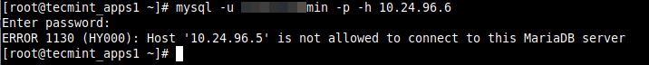
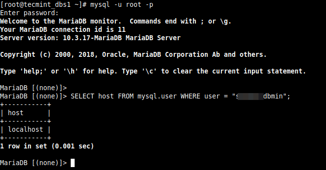
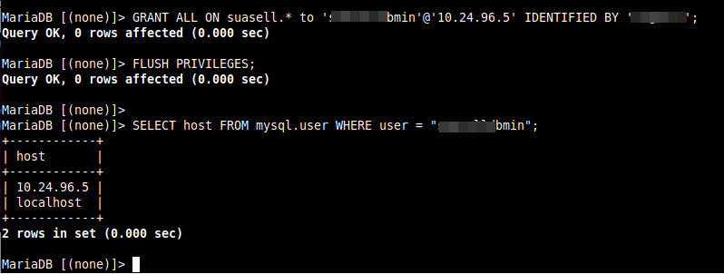
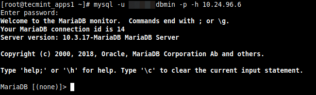

# 如何修复错误1130(HY000): 主机不允许连接到这个MySQL服务器

在本文中，你将了解如何解决Linux系统上MySQL/MaraDB数据库部署中的"ERROR 1130(HY000): Host x.x.x.x is not allowed to connection to this MySQL server"粗偶。这是用户遇到的常见的远程数据库连接错误之一。

## 测试环境

- 应用服务器 IP: 10.24.96.5
- 数据库服务器IP: 10.24.96.6

我们在使用mysql客户端测试从应用程序服务器到数据库服务器的数据库连接时遇到了错误，如下所示。

```shell
# mysql -u database_username -p -h 10.24.96.6
```



错误指示数据库用户正在连接的主机10.24.96.5 不允许连接到MySQL服务器，在这种情况下，我们必须对数据库服务器进行一些更改，以使用户能够进行远程连接。

在数据库服务器上，我们必须检查上述用户允许连接的主机。

```shell
# mysql -u root -p 
```

运行以下SQL命令来检查用户的主机：

```sql
mysql> SELECT host FROM mysql.user WHERE user = "database_username";
```



从命令行的输出中，只允许用户从本地主机连接到数据库服务器，因此，我们需要想下面这样更新用户的主机。

运行下面的GRANT命令，以使来自 远程主机的远程用户能够访问MySQL, 确保"10.24.96.6"替换为远程系统的IP地址。并将'database_password'替换为你希望"database_username"使用的密码：

```sql
mysql> GRANT ALL ON database_name.* to 'database_username'@'10.24.96.5' IDENTIFIED BY 'database_password';
mysql> FLUSH PRIVILEGES;
mysql> SELECT host FROM mysql.user WHERE user = "database_username";
```




要让用户远程访问网络上的所有主机，请使用以下语法：

```sql
mysql> GRANT ALL ON database_name.* to 'database_username'@'10.24.96.%' IDENTIFIED BY 'database_password';
```

完成上述更改后，再次尝试远程连接到MySQL数据库服务器，连接应该是成功的，如下面的截图所示：

```
# mysql -u database_username -p -h 10.24.96.6
```

