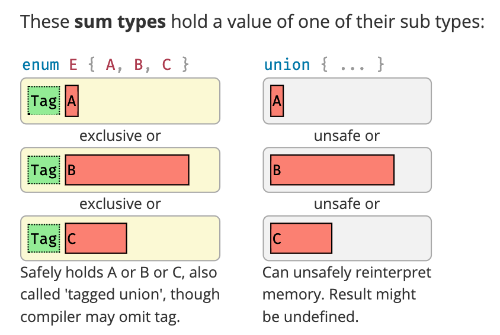

# 总结

## A Bad Singly-Linked Stack 

### Basic Data Layout

什么是链表呢？它是在堆上的一堆数据按顺序指向对方。

一个链表的定义：（函数式语言中给出的定义）

`List a = Empty | Elem a (List a) `

a List is either Empty or an Element followed a List. This is **Sum Type**.

在Rust中:

```rust
enum List {
    //^^^^ recursive type has infinite size
    Empty,
    Elem(i32, List), //这是一个递归的定义
    //recursive without indirection
}
```
可以看到的是这个是一个indinite size Tyep，
Elem(i32, List), 中包含了有一个List,而第一个List的大小需要清楚的知道到底有多少个List,才能确定他的大小。

Rust给出的解决提示：

**insert indirection (eg, Box, Rx, &) at some point to make**

```rust
#[lang = "owned_box"]
pub struct Box<T>(_)
 where
    T: ?Sized;
//A pointer type for heap allocation.

// pub fn new(x: T) -> Box<T>

//Allocates memory on the heap and then places x into it.

//This doesn't actually allocate if T is zero-sized.

let five = Box::new(5);

// Box<T>, casually referred to as a 'box', provides the simplest form of heap allocation in Rust. Boxes provide ownership for this allocation, and drop their contents when they go out of scope.

#[derive(Debug)]
enum List<T> {
    Cons(T, Box<List<T>>),
    Nil,
}
fn main() {
    let list: List<i32> = List::Cons(1, Box::new(List::Cons(2, Box::new(List::Nil))));
    println!("{:?}", list);
}
```

因此链表的定义是：
```rust
enum List{
    Empty,
    Elem(i32, Box<List>),
} 
```

第一种链表的布局：

```
[] = Stack 
() = Heap 

[Elem A, ptr] -> (Elem B, ptr) -> (Empty, *junk*)

```

1、最后一个节点Empty中什么数据也没有他也需要占用内存，因为这个节点后续可能变为一个有数据的节点，因此，这个空闲的Empty也需要占用一个数据的大小和一个指针的内存大小。

2、第一个节点没有进行堆内存分配

Enum 的内存布局



第二种链表的布局：

```
[ptr] -> (Elem A, ptr) -> (Elem B, *null*)
```

在这个布局中我们可以随意的分配堆节点。
这里的不同之处(和第一个布局的不同之处在于，最后一个节点的 junk 数据)

```rust
enum Foo {
    D1(T1),
    D2(T2),
    D3(T3),
}
```

Foo 中需要存储一些整数来指示它表示的枚举变量D1, D2, D3,这个就是枚举的标签Tag,可以看上面的内存布局图就是上面的Tag，也需要占用内存。还需要存储足够的空间来存储T1,T2, T3这里也是就是上面内存布局图中的 E中的内存布局分布大小。此外还有一些额外的空间需要满足对齐的要求。


对于布局1， 尽管Empty是一个单独信息位， 但它必须为一个指针和一个元素消耗足够的空间，因为他随时准备好成为一个Elem。

因此第一布局堆分配了一个额外的元素，该元素充满了垃圾，比布局2要消耗更多的空间。

这里布局1的第一个节点没有分配，但是总是别分配要要糟糕的，因为这会带来非统一的布局。

这个对于push和pop没有什么影响，但是对于链表的分隔会带来问题：

```
layout 1:

[Elem A, ptr] -> (Elem B, ptr) -> (Elem C, ptr) -> (Empty *junk*)

split off C:

[Elem A, ptr] -> (Elem B, ptr) -> (Empty *junk*)
[Elem C, ptr] -> (Empty *junk*)


```

```
layout 2:

[ptr] -> (Elem A, ptr) -> (Elem B, ptr) -> (Elem C, *null*)

split off C:

[ptr] -> (Elem A, ptr) -> (Elem B, *null*)
[ptr] -> (Elem C, *null*)

```
可以看到的是布局2的拆分仅仅复制B中指向堆内存的指针就可以了，对于布局1来说还必须将C也从堆内存复制到栈内存中去。

链表的好处是，可以在节点本身中构造元素，然后在不移动它的情况下在列表中移动它。

这样做也是不对的：

```rust
enum List {
    Empty, 
    ElemThenEmpty(i32),
    ElemThenNotEmpty(i32, Box<List>),
}
```

这个是糟糕的，因为有一个完全无效的状态，ElemThenNotEmpty(0, Box< Empty >).

这个完全避免了分配Empty case, 将堆分配的总数减少了1，但是这会浪费更多的空间。（这是因为前面布局利用了空指针优化）。


### 空指针优化
> 原文作者：Rust 技术论坛文档：《Rust 高级编程（2018）》
转自链接：https://learnku.com/docs/nomicon/2018/110-ffi/4756


一些 Rust 类型被定义为永不为 null，包括引用（&T、&mut T）、Box<T>、以及函数指针（extern "abi" fn()）。可是在使用 C 的接口时，指针是经常可能为 null 的。看起来似乎需要用到 transmute 或者非安全代码来处理各种混乱的类型转换。但是，Rust 其实提供了另外的方法。

一些特殊情况中，enum 很适合做空指针优化，只要它包含两个变量，其中一个不包含数据，而另外一个包含一个非空类型的成员。这样就不需要额外的空间做判断了：给那个包含非空成员的变量传递一个 null，用它来表示另外那个空的变量。这种行为虽然被叫做 “优化”，但是和其他的优化不同，它只适用于合适的类型。

最常见的受益于空指针优化的类型是 Option<T>，其中 None 可以用 null 表示。所以 Option<extern "C" fn(c_int) - > c_int> 就很适合表示一个使用 C ABI 的可为空的函数指针（对应于 C 的 int (*)(int)）。

```rust
extern crate libc;
use libc::c_int;

extern "C" {
    // 注册回调。
    fn register(cb: Option<extern "C" fn(Option<extern "C" fn(c_int) -> c_int>, c_int) -> c_int>);
}

// 这个函数其实没什么实际的用处。它从C代码接受一个函数指针和一个整数，
// 用整数做参数调用指针指向的函数，并返回函数的返回值。
// 如果没有指定函数，那默认就返回整数的平方。
extern "C" fn apply(process: Option<extern "C" fn(c_int) -> c_int>, int: c_int) -> c_int {
    match process {
        Some(f) => f(int),
        None    => int * int
    }
}

fn main() {
    unsafe {
        register(Some(apply));
    }
}
```

一个简单的例子：空指针优化

```rust
enum Foo {
    A, 
    B(i32),
}
```

空指针起作用，这样啊就能消除tag所占用的空间。
如果变量是A， 则整个枚举都设置为0， 否则变量是B。
这里的B不可能是0，因为他包含了一个非零指针。

```rust
fn main(){
    println!("Foo = {}", std::mem::size_of::<Foo>()); // 8
}

enum Foo { // tag 4
    A, // 0
    B(i32),// 4
}
```
其他一些类型和Enum配合使用能使用空指针优化的是：
&, &mut, Box, Rc, Arc, Vec.

如何才能同时实现避免额外的内存分配， 统一的内存分配， 空指针优化？

我们需要区分拥有一个元素和分配一个列表的概念。
Enum可以把包含多个不同类型的值中的一个，struct允许同时声明一个包含多个值的类型。

> Enum是和类型，struct是积类型。

List要么是Empty，或者是一个元素后跟着一个List。

```rust
struct Node {
    elem: i32,
    next: List,
}

pub enum List { //pub enum 会将字段全部公开
    Empty,
    More(Box<Node>),// error, Node is Private
}


```

```rust
pub struct List {
    head: Link, //List只有一个字段，所以他的大小和该字段相同
}

enum Link {
    Empty,
    More(Box<Node>),
}

struct Node {
    elem: i32,
    next: Link,
}
```

## NEW

New方法也可以称为Rust中的构造函数方法。

```rust
impl List {
    pub fn new() -> Self {
        Self { head: Link::Empty }
    }
}
```
上面两处的Self的使用的优点，后面如果有代码的变动，例如结构的名字的变动，后期代码的重构。
函数的最后一个表达式是隐式返回的。
`::是命名空间操作符`

## 所有权

所有权的三种不同的语义：

- self - Vale, Value具有移动语义，具有所有权
- &mut self - mutable reference，可变引用（唯一引用）， 对值没有所有权，只是对不拥有的得值临时独占访问权（这也是称为唯一引用的原因）， 可以进行任何mutable 操作
- &self - shared reference，共享引用，对不拥有的值临时的共享访问，不允许进行mutable操作。


## PUSH

```rust
impl List {
    pub fn push(&mut self, elem: i32) {
        let new_node = Node {
            elem: elem,
            next: self.head, //error, cannot move out of borroed content
        };
    }
}
// push中的self是&mut self类型，只是可变借用了slef。
//对于结构体的初始化，next,是具有移动语义类型的成员，next: self.head 这样会发生移动操作，但是rust中明确的规定了可变引用没有拥有所有权，所以出错。

```

如果把东西在在放回去呢？

```rust
pub fn push(&mut self, elem: i32) {
    let new_node = Box::new(Node {
        elem: elem,
        next: self.head, // error, cannot 
    });
    // 我们在结束后放回去，应该是可以的但是rust中不可以。

    
    self.head = Link::More(new_node);
}
```

std::mem::replce(&mut dst, src);

This incredibly useful function lets us steal a value out of a borrow by replacing it with another value.

可以通过一个替换操作mem::replce()， 让我们通过用另一个值替换一个借用来窃取一个值。


使用replace 之后：

```rust

impl List {
    pub fn push(&mut self, elem: i32) {
        let new_node = Box::new(Node {
            elem,
            next: std::mem::replace(&mut self.head, Link::Empty),
        });

        self.head = Link::More(new_node);
    }
}
```

## POP

pop要返回一个值，这个值可能有（list不为空时）或者为空，这样返回一个Option<i32>就可以了。

```rust

pub fn pop(&mut self) -> Option<i32> {
    match self.head {
        Link::Empty => {
            // TODO
        }
        Link::More(node) => {
            // TODO
        }
    };
}

```


使用unimplemented!()， 表示还没有完成函数的实现

```rust
pub fn pop(&mut self) -> Option<i32> {
    match self.head {
        Link::Empty => {
            // TODO
        }
        Link::More(node) => {
            // TODO
        }
    };
    unimplemented!()
}

```

```
> cargo build

error[E0507]: cannot move out of borrowed content
  --> src/first.rs:28:15
   |
28 |         match self.head {
   |               ^^^^^^^^^
   |               |
   |               cannot move out of borrowed content
   |               help: consider borrowing here: `&self.head`
...
32 |             Link::More(node) => {
   |                        ---- data moved here
   |
note: move occurs because `node` has type `std::boxed::Box<first::Node>`, which does not implement the `Copy` trait
  --> src/first.rs:32:24
   |
32 |             Link::More(node) => {
   |                        ^^^^

```

默认情况下，match尝试将其内存移动到新的分支。

通过在self.head上加一个reference解决。

```RUST
pub fn pop(&mut self) -> Option<i32> {
    match &self.head {
        Link::Empty => {
            // TODO
        }
        Link::More(ref node) => {
            // TODO
        }
    };
    unimplemented!()
}

```

```RUST
pub fn pop(&mut self) -> Option<i32> {
    let result;
    match &self.head {
        Link::Empty => {
            result = None;
        }
        Link::More(ref node) => {
            result = Some(node.elem);
            self.head = node.next; //ERROR, NODE 是一个reference, Cannot move out of borroed content
        }
    };
    result
}

```
```
> cargo build
   Compiling lists v0.1.0 (/Users/ABeingessner/dev/temp/lists)
error[E0507]: cannot move out of borrowed content
  --> src/first.rs:35:29
   |
35 |                 self.head = node.next;
   |                             ^^^^^^^^^ cannot move out of borrowed content


```

- Check if the list is empty.

- If it's empty, just return None
    - If it's not empty
    - remove the head of the list
    - remove its elem
    - replace the list's head with its next
    - return Some(elem)

这里是因为，要删除东西，意味着通过所有权（vale）获取list的head。不能通过&self.head来操作。

这里只有一个可变引用， 所以只能通过replace来实现了


```rust
pub fn pop(&mut self) -> Option<i32> {
    let result;
    match mem::replace(&mut self.head, Link::Empty) {
        Link::Empty => {
            result = None;
        }
        Link::More(node) => {
            result = Some(node.elem);
            self.head = node.next;
        }
    };
    result
}
```

优化，一个函数的最后一个表达式就是返回的值。

```RUST
pub fn pop(&mut self) -> Option<i32> {
    match mem::replace(&mut self.head, Link::Empty) {
        Link::Empty => None,
        Link::More(node) => {
            self.head = node.next;
            Some(node.elem)
        }
    }
}
```

## TEST

```rust
#[cfg(test)]
mod test {
    use super::List;

    #[test]
    fn basics() {
        let mut list = List::new();

        // Check empty list behaves right
        assert_eq!(list.pop(), None);

        // Populate list
        list.push(1);
        list.push(2);
        list.push(3);

        // Check normal removal
        assert_eq!(list.pop(), Some(3));
        assert_eq!(list.pop(), Some(2));

        // Push some more just to make sure nothing's corrupted
        list.push(4);
        list.push(5);

        // Check normal removal
        assert_eq!(list.pop(), Some(5));
        assert_eq!(list.pop(), Some(4));

        // Check exhaustion
        assert_eq!(list.pop(), Some(1));
        assert_eq!(list.pop(), None);
    }
}

```

## DROP

Rust中的析构函数等同就是Drop trait来实现的：

```RUST
pub trait Drop {
    fn drop(&mut self);
}
```

对于list来说， drop的自动析构可能会有问题。
在list中，你要做的就是drop list的head， 而head又会drop Box< Node >, 

考虑：
list -> A -> B -> C 

当list被删除时， 它尝试删除A， 而A尝试删除B， 而B尝试删除C，这是一个递归的代码。

```rust
impl Drop for List {
    fn drop(&mut self) {
        // NOTE: you can't actually explicitly call `drop` in real Rust code;
        // we're pretending to be the compiler!
        self.head.drop(); // tail recursive - good!
    }
}

impl Drop for Link {
    fn drop(&mut self) {
        match *self {
            Link::Empty => {} // Done!
            Link::More(ref mut boxed_node) => {
                boxed_node.drop(); // tail recursive - good!
            }
        }
    }
}

impl Drop for Box<Node> {
    fn drop(&mut self) {
        self.ptr.drop(); // uh oh, not tail recursive!
        deallocate(self.ptr);
    }
}

impl Drop for Node {
    fn drop(&mut self) {
        self.next.drop();
    }
}

```

我们没有办法删除Box后面的内容，所以没有以尾递归的方式删除。
不得不编写一个迭代的版本删除节点。

```RUST
impl Drop for List {
    fn drop(&mut self) {
        let mut cur_link = mem::replace(&mut self.head, Link::Empty);
        // `while let` == "do this thing until this pattern doesn't match"
        while let Link::More(mut boxed_node) = cur_link {
            cur_link = mem::replace(&mut boxed_node.next, Link::Empty);
            // boxed_node goes out of scope and gets dropped here;
            // but its Node's `next` field has been set to Link::Empty
            // so no unbounded recursion occurs.
        }
    }
}

```


## FINAL CODE

```RUST

#![allow(unused_variables)]
fn main() {
use std::mem;

pub struct List {
    head: Link,
}

enum Link {
    Empty,
    More(Box<Node>),
}

struct Node {
    elem: i32,
    next: Link,
}

impl List {
    pub fn new() -> Self {
        List { head: Link::Empty }
    }

    pub fn push(&mut self, elem: i32) {
        let new_node = Box::new(Node {
            elem: elem,
            next: mem::replace(&mut self.head, Link::Empty),
        });

        self.head = Link::More(new_node);
    }

    pub fn pop(&mut self) -> Option<i32> {
        match mem::replace(&mut self.head, Link::Empty) {
            Link::Empty => None,
            Link::More(node) => {
                self.head = node.next;
                Some(node.elem)
            }
        }
    }
}

impl Drop for List {
    fn drop(&mut self) {
        let mut cur_link = mem::replace(&mut self.head, Link::Empty);

        while let Link::More(mut boxed_node) = cur_link {
            cur_link = mem::replace(&mut boxed_node.next, Link::Empty);
        }
    }
}

#[cfg(test)]
mod test {
    use super::List;

    #[test]
    fn basics() {
        let mut list = List::new();

        // Check empty list behaves right
        assert_eq!(list.pop(), None);

        // Populate list
        list.push(1);
        list.push(2);
        list.push(3);

        // Check normal removal
        assert_eq!(list.pop(), Some(3));
        assert_eq!(list.pop(), Some(2));

        // Push some more just to make sure nothing's corrupted
        list.push(4);
        list.push(5);

        // Check normal removal
        assert_eq!(list.pop(), Some(5));
        assert_eq!(list.pop(), Some(4));

        // Check exhaustion
        assert_eq!(list.pop(), Some(1));
        assert_eq!(list.pop(), None);
    }
}
}
```

# An Ok Singly-Linked Stack 

- 使用Option
- 加入泛型
- 加入迭代器

```rust
use std::mem;

pub struct List {
    head: Link,
}

//Update 
type Link = Option<Box<Node>>;

struct Node {
    elem: i32,
    next: Link,
}

impl List {
    pub fn new() -> Self {
        List { head: None } //update
    }

    pub fn push(&mut self, elem: i32) {
        let new_node = Box::new(Node {
            elem: elem,
            next: mem::replace(&mut self.head, None),// update
        });

        self.head = Some(new_node);
    }

    pub fn pop(&mut self) -> Option<i32> {
        match mem::replace(&mut self.head, None) {
            None => None, // update
            Some(node) => { //update 
                self.head = node.next;
                Some(node.elem)
            }
        }
    }
}

impl Drop for List {
    fn drop(&mut self) {
        let mut cur_link = mem::replace(&mut self.head, None); //update
        while let Some(mut boxed_node) = cur_link { // update 
            cur_link = mem::replace(&mut boxed_node.next, None); // update
        }
    }
}

```

mem::replace(&mut option, None), 在Option中是很常见的习惯用法，所以Option提供了一个等同的方法take()

```rust
pub struct List {
    head: Link,
}

type Link = Option<Box<Node>>;

struct Node {
    elem: i32,
    next: Link,
}

impl List {
    pub fn new() -> Self {
        List { head: None }
    }

    pub fn push(&mut self, elem: i32) {
        let new_node = Box::new(Node {
            elem: elem,
            next: self.head.take(),
        });

        self.head = Some(new_node);
    }

    pub fn pop(&mut self) -> Option<i32> {
        match self.head.take() { // update take way
            None => None,
            Some(node) => {
                self.head = node.next;
                Some(node.elem)
            }
        }
    }
}

impl Drop for List {
    fn drop(&mut self) {
        let mut cur_link = self.head.take();//update take way
        while let Some(mut boxed_node) = cur_link {
            cur_link = boxed_node.next.take();// update take way
        }
    }
}

```

对于
```rust
match Option {
    None => None, 
    Some(x) => {
        // do something
        Some(y)
    }
}

这是一个非常常用的用法，等价于map()这个函数， 使用方法将一个闭包函数传递给map()
```

```rust 
//before
pub fn pop(&mut self) -> Option<i32> {
    match self.head.take() { // update take way
        None => None,
        Some(node) => {
            self.head = node.next;
            Some(node.elem)
        }
    }
}

//after 
pub fn pop(&mut self) -> Option<i32> {
    self.head.take().map(|node| {
        self.head = node.next;
        node.elem
    })
}
```

### Generic 

加入泛型

```rust
pub struct List {
    head: Link<T>,
}

type Link<T> = Option<Box<Node>>;

struct Node<T> {
    elem: T,
    next: Link<T>,
}

impl<T> List<T> {
    pub fn new() -> Self {
        Self { head: None }
    }

    pub fn push(&mut self, elem: T) {
        let new_node = Box::new(Node {
            elem: elem,
            next: self.head.take(),
        });

        self.head = Some(new_node);
    }

    pub fn pop(&mut self) -> Option<T> {
        match self.head.take() { // update take way
            None => None,
            Some(node) => {
                self.head = node.next;
                Some(node.elem)
            }
        }
    }
}

impl<T> Drop for List<T> {
    fn drop(&mut self) {
        let mut cur_link = self.head.take();//update take way
        while let Some(mut boxed_node) = cur_link {
            cur_link = boxed_node.next.take();// update take way
        }
    }
}
```

## PEEK

```rust
pub fn peek(&self) -> Option<&T> {
    self.head.map(|node| {
        &node.elem
    })
}

```

```
> cargo build

error[E0515]: cannot return reference to local data `node.elem`
  --> src/second.rs:37:13
   |
37 |             &node.elem
   |             ^^^^^^^^^^ returns a reference to data owned by the current function

error[E0507]: cannot move out of borrowed content
  --> src/second.rs:36:9
   |
36 |         self.head.map(|node| {
   |         ^^^^^^^^^ cannot move out of borrowed content


```

这是因为self.head是Option< Box < Node < T > >>是一个具有移动语义的类型，使用map的话默认是获取的所有权，但是peek的方法是一个不可变引用， cannot move out of borrowed content，如果把这个借用中的所有权移走后，这个借用就悬空了，rust的借用规则禁止这样做。

可以使用Option中的as_ref方法返回的是引用

```rust
impl<T> Option<T> {
    pub fn as_ref(&self) -> Option<&T>;
}
```
引用是Copy语义的，所以map方法不会将所有权转移走。

```RUST

// 不可变版本
pub fn peek(&self) -> Option<&T> {
    self.head.as_ref().map(|node| {
        &node.elem
    })
}

// 可变版本
pub fn peek_mut(&mut self) -> Option<&mut T> {
    self.head.as_mut().map(|node| {
        &mut node.elem
    })
}

```

test

```rust
#[test]
fn peek() {
    let mut list = List::new();
    assert_eq!(list.peek(), None);
    assert_eq!(list.peek_mut(), None);
    list.push(1); list.push(2); list.push(3);

    assert_eq!(list.peek(), Some(&3));
    assert_eq!(list.peek_mut(), Some(&mut 3));
}

#[test]
fn peek() {
    let mut list = List::new();
    assert_eq!(list.peek(), None);
    assert_eq!(list.peek_mut(), None);
    list.push(1); list.push(2); list.push(3);

    assert_eq!(list.peek(), Some(&3));
    assert_eq!(list.peek_mut(), Some(&mut 3));

    list.peek_mut().map(|value| {
        *value = 42
    });

    assert_eq!(list.peek(), Some(&42));
    assert_eq!(list.pop(), Some(42));
}


```

## IntoIter

迭代器

```rust
pub trait Iterator {
    type Item; //关联类型,这个是下次调用后返回的类型。
    fn next(&mut self) -> Option<Self::Item>;
}

```

迭代器的返回值使用Option< Self::Item > 原因是因为融合了get_next()和has_next()，的两个概念。

rust提供了三种不同的迭代器：

- IntoIter - T
- IntoMut - &mut T
- Iter - &T

使用list的pop实现

```rust

// Tuple structs are an alternative form of struct,
// useful for trivial wrappers around other types.
pub struct IntoIter<T>(List<T>);

impl<T> List<T> {
    pub fn into_iter(self) -> IntoIter<T> {
        IntoIter(self)
    }
}

impl<T> Iterator for IntoIter<T> {
    type Item = T;
    fn next(&mut self) -> Option<Self::Item> {
        // access fields of a tuple struct numerically
        self.0.pop()
    }
}

```

```rust

#[test]
fn into_iter() {
    let mut list = List::new();
    list.push(1); list.push(2); list.push(3);

    let mut iter = list.into_iter();
    assert_eq!(iter.next(), Some(3));
    assert_eq!(iter.next(), Some(2));
    assert_eq!(iter.next(), Some(1));
    assert_eq!(iter.next(), None);
}

```


