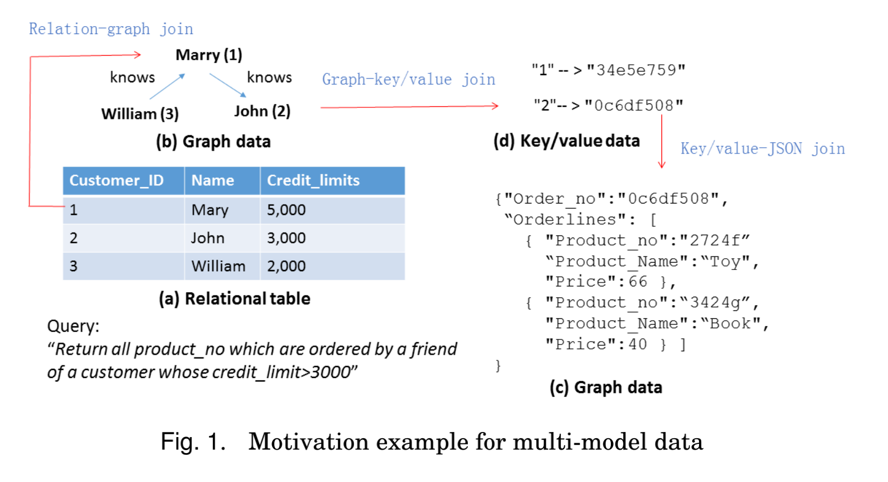
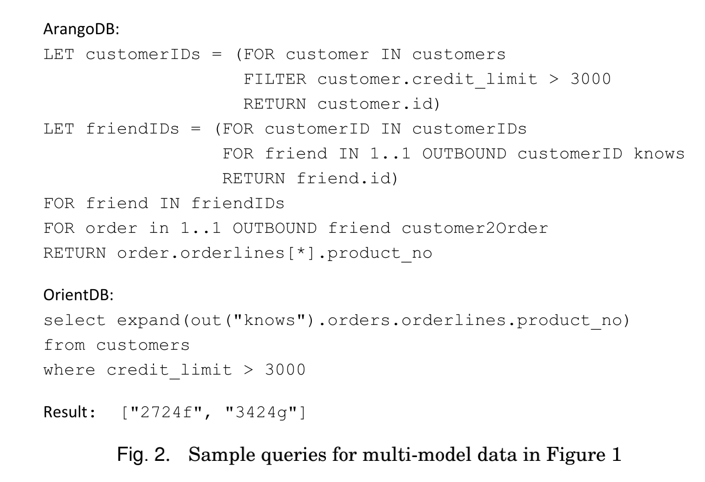
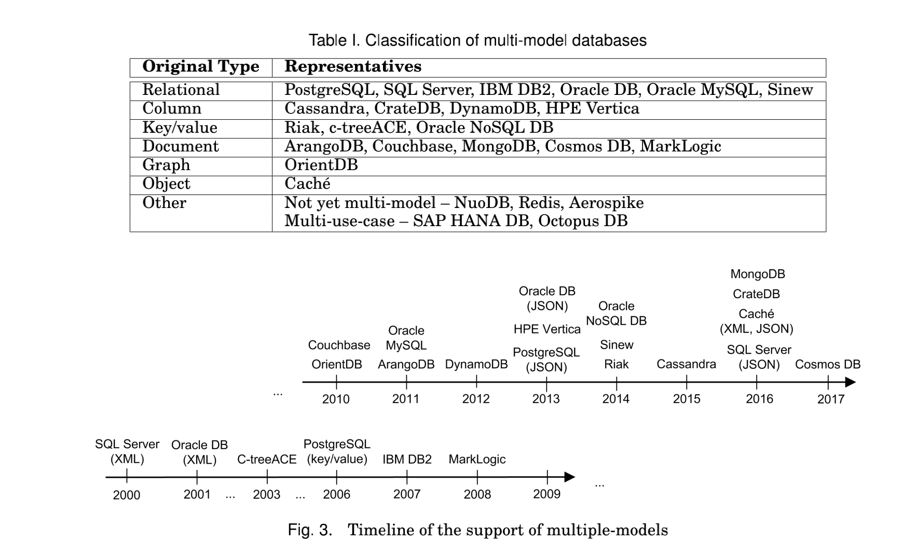
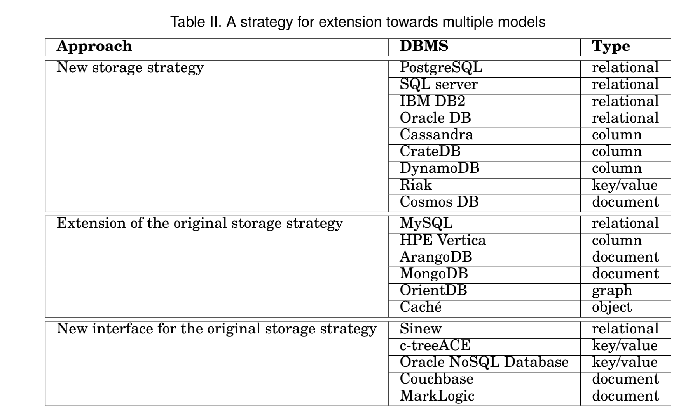
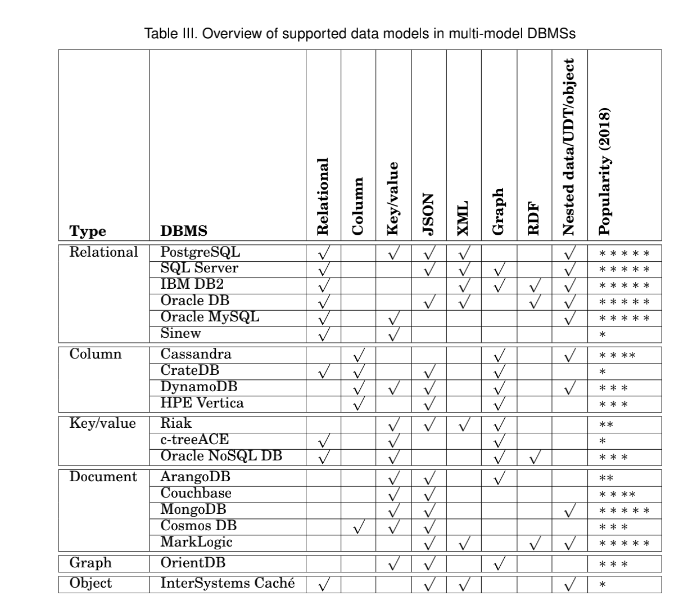

# **Multi-model Databases: A New Journey to Handle the Variety of Data**

# 多模型数据库-处理各种数据的新旅程

The variety of data is one of the most challenging issues for the research and practice in data management systems. The data are naturally organized in different formats and models, including structured data, semi structured data and unstructured data. In this survey, we introduce the area of multi-model DBMSs which build a single database platform to manage multi-model data. Even though multi-model databases are a newly emerging area, in recent years we have witnessed many database systems to embrace this category. We provide a general classifification and multi-dimensional comparisons for the most popular multi-model databases. This comprehensive introduction on existing approaches and open problems, from the technique and application perspective, make this survey useful for motivating new multi-model database approaches, as well as serving as a technical reference for developing multi-model database applications.

数据的多样性是数据管理系统研究和实践中最具挑战性的问题之一。数据自然以不同的格式和模型组织起来，包括结构化数据、半结构化数据和非结构化数据。在本次调查中，我们介绍了多模型DBMS的领域，它的特点是 构建一个单一的数据库平台来管理多模型数据。尽管多模型数据库是一个新兴的领域，近年来，我们见证了许多数据库系统来拥抱这个范畴。我们为最流行的多模型数据库提供了一个通用的分类和多维度的比较。本次全面介绍了现有的方法和开放的问题，从技术上讲 和应用的角度，使得这项调查对激励新的多模型数据库方法很有帮助。以及作为开发多模型数据库应用的技术参考。

---

CCS Concepts: Information systems → Database design and models; Data model extensions; Semistructured data; Database query processing; Query languages for non-relational engines; Extraction, transformation and loading; Object-relational mapping facilities;
Additional Key Words and Phrases: Big Data management, multi-model databases, NoSQL database management systems.

CCS概念。信息系统 → 数据库设计和模型；数据模型扩展；半结构化数据；数据库查询处理；非关系引擎的查询语言；提取、转换和加载；对象关系映射设施。
附加关键词和短语。大数据管理、多模型数据库、NoSQL数据库管理系统。

---

## 1 Introduction

As data with different types and formats are crucial for the optimal business decisions, we observe the substantial increase of demands to analyze and manipulate multimodel data, including structured, semi-structured and unstructured data. In particular, structured data includes relational, key/value, and graph data. Semi-structured
data commonly refer to XML and JSON documents. Unstructured data are typically text files, containing dates, numbers and facts.

由于不同类型和格式的数据对优化商业决策至关重要，我们观察到分析和处理多模型数据的需求大幅增加，包括结构化、半结构化和非结构化数据。特别是，结构化数据包括关系数据、键/值数据和图数据。半结构化数据
数据通常指的是XML和JSON文档。非结构化数据通常是文本文件，包含日期、数字和事实。

---

We illustrate the challenge of the variety of data with three examples as follows. First, let us consider customer-360-view [Kotorov 2003] to enable a holistic analysis on customer behaviors. This application demands to analyze the information from different data sources, such as product catalog (XML or JSON documents), customer social networks (graph data), social media (unstructured data) and relational tables of customer shopping records. Second, in the context of healthcare, high volumes of data are generated by multiple data sources [Aboudi and Benhlima 2018], including electrical health records (relational data), treatment plans and lab test reports (unstructured data), and health condition parameters for real-time patient health monitoring (key/value data). Finally, an oil & Gas company [Hems et al. 2013] might generate over 1.5 TB of diverse data every day [Baaziz and Quoniam 2014]. Those data come from diverse resources, such as sensors, GPS, and other instruments, and consequently have heterogeneous formats. Therefore, the above three examples demonstrate the emerging challenges to manipulate and analyze multi-model data in complex application scenarios.

我们用以下三个例子来说明数据多样性的挑战。首先，让我们考虑客户360-view[Kotorov 2003]，以实现对客户行为的整体分析。这个应用要求分析来自不同数据源的信息，如产品目录（XML或JSON文档）、客户社交网络（图形数据）、社交媒体（非结构化数据）和客户购物记录的关系表。其次，在医疗保健的背景下，大量的数据是由多种数据源产生的[Aboudi和Benhlima 2018]，包括电健康记录（关系型数据）、治疗计划和实验室测试报告（非结构化数据）以及用于实时监测患者健康状况的健康状况参数（键/值数据）。最后，一家石油天然气公司[Hems等人，2013]每天可能会产生超过1.5TB的多样化数据[Baaziz和Quoniam，2014]。这些数据来自不同的资源，如传感器、GPS和其他仪器，因此具有异构的格式。因此，以上三个例子展示了在复杂应用场景中操作和分析多模型数据的新挑战。

---

We now exemplify the challenge of multi-model data management with a concrete small example from Ecommerce in Figure 1, which contains customers, social network and orders information with four distinct data models. Customers information are stored in a relational table – their ID, name, and credit limits. Graph data bear information about mutual relationships between the customers, i.e. who knows whom. In JSON documents each order has an ID and a sequence of ordered items, each of which includes product number, name, and price. The fourth type of data, key/value pairs, bears a relationship between customers (their IDs) and orders (their IDs).

现在我们用图1中一个电子商务的具体小例子来说明多模型数据管理的挑战，图中包含客户、社交网络和订单信息，有四个不同的数现在我们用图1中一个来自电子商务的具体小例子来说明多模型数据管理的挑战，图中包含客户、社交网络和订单信息，有四个不同的数据模型。客户信息存储在一个关系表中--他们的ID、姓名和信用额度。图形数据承载 客户之间相互关系的信息，即谁认识谁。在JSON文档中，每个订单都有一个ID和一个订单项目序列，每个项目序列包括产品编号、名称和价格。第四类数据，键/值对，承担着客户（他们的ID）和订单（他们的ID）之间的关系。

---

In these multi-model data one may be interested in a recommendation query, which returns “all product numbers ordered by a friend of a customer whose credit limit is greater than 3000”. Such a query can be evaluated using various approaches depending on the selected storage strategy. Either the data is stored in different database management systems (DBMSs) corresponding to the four data models, or the four types of data are transformed into a single format, e.g., the relational format, and stored in a relational database system. However, in the former case we need to solve the problems of (1) the installation and administration of multiple distinct systems and (2) joining data stored at distinct places. In the latter case, even though storing hierarchical or graph data in a relational DBMS is feasible, the efficiency of query evaluation is a bottleneck due to the inherent structural differences from flat relations.

在这些多模型数据中，人们可能会对一个推荐查询感兴趣，这就是 返回 "信用额度为的客户朋友所订购的所有产品编号 大于3000"。这样的查询可以根据所选择的存储策略，采用不同的方法进行评估。要么将数据存储在与四种数据模型相对应的不同的数据库管理系统(DBMS)中，要么将四种类型的数据转化为单一格式，如关系格式，并存储在关系数据库系统中。然而，在前一种情况下，我们需要解决以下问题：(1)多个不同系统的安装和管理；(2)加入存储在不同地方的数据。在后一种情况下，即使在关系型DBMS中存储分层或图形数据是可行的，但由于与平面关系的内在结构差异，查询评估的效率是一个瓶颈。

---

A third option for the above task is to employ a single multi-model DBMS to exploit advantages of both the previous solutions: (1) The data is stored in the way optimal for the particular models and (2) only a single DBMS is employed to conveniently query across all the models. In Figure 2, we show two sample queries to return the requested result for two existing multi-model databases – ArangoDB [ArangoDB 2016] and OrientDB [OrientDB 2016] respectively.1 A single data platform for multi-model data is beneficial to users by providing not only a unified query interface, but a single database platform to simplify query operations, reduce integration issues, and eliminate migration problems.

上述任务的第三种选择是采用单一的多模型DBMS来利用前面两种解决方案的优势。(1)数据的存储方式对特定的模型来说是最优的；(2)只采用一个DBMS来方便地跨所有模型查询。在图2中，我们展示了两个示例查询，分别针对现有的两个多模型数据库--ArangoDB[ArangoDB 2016]和OrientDB[OrientDB 2016]返回所要求的结果，1多模型数据的单一数据平台不仅提供了统一的查询界面，而且还提供了一个单一的数据库平台，以简化查询操作，减少集成问题，并消除迁移问题，这对用户是有利的。

---

In general, there are two existing approaches to manipulate and query multi-model data: (1) polyglot persistence and (2) multi-model databases [Lu and Holubova 2017; Lu et al. 2018a]. First, the history of polyglot persistence can be traced back to multi databases [Smith et al. 1981] and federation databases [Hammer and McLeod 1979], which were intensively studied during the 1980s. Their main strategy is to leverage different databases to store different models of data and then develop a mediator to integrate them together to answer queries. Recently, some research prototypes are developed on polyglot persistence platform. For example, DBMS+ [Lim et al. 2013] targets at embracing several processing and database platforms with a unified declarative processing. BigDAWG [Elmore et al. 2015] provides an architecture that supports for location transparency and a middleware that provides a uniform multi-island interface to run users’ queries with three different integrated systems: PostgreSQL, SciDB and Accumulo.

一般来说，现有两种方法来操作和查询多模型数据。(1)多模型持久化和(2)多模型数据库[Lu和Holubova，2017；Lu等，2018a]。首先，多模型持久化的历史可以追溯到多数据库[Smith等1981]和联盟数据库[Hammer和McLeod 1979]，这两个数据库在20世纪80年代被深入研究。他们的主要策略是利用不同的数据库来存储不同的数据模型，然后开发一个中介机构将它们整合在一起回答查询。最近，一些研究原型都是在多元持久化平台上开发的。例如，DBMS+[Lim et al. 2013]的目标是拥抱多个处理和数据库平台，进行统一的声明式处理。BigDAWG[Elmore等，2015]提供了一个支持位置透明的架构，以及一个提供统一多岛接口的中间件，以三个不同的集成系统运行用户的查询。PostgreSQL、SciDB和Accumulo。

---

The second kind of systems is to build one single database to manage different data models with a fully integrated backend to handle the system demands for performance, scalability, and fault tolerance [Lu et al. 2018b]. A framework of a fullyintegrated single management system can be traced back to the concept of ORDBMS (i.e., Object-Relational DataBase Management Systems), which borrow and adapt the object-oriented programming model into the relational databases. An ORDBMS can store and process various formats of data such as relational, text, XML, spatial and object by leveraging domain specific functions. But the salient difference between the ORDBMS and multi-model databases is that, in an ORDBMS framework, only the relational model is the first-class citizen, meaning all other models are developed on top of relational technology. But in multi-model databases, there is no indispensable model and every model is equally important. Compared with the first system of polyglot persistence, the second one manages multiple models with an integrated backend which can satisfy the growing requirements for scalability, high performance and fault tolerance. In this survey, we will focus on the second approach by building a single multi-model database. As for the first approach, interesting readers may refer to Appendix C.

第二种是建立一个单一的数据库来管理不同的系统。数据模型与全集成后台，以处理系统对性能、可扩展性和容错性的需求[Lu等，2018b]。全集成单管理系统的框架可以追溯到ORDBMS（即对象-关系数据库管理系统）的概念，ORDBMS借鉴并改造了面向对象的编程模型，融入了关系数据库。ORDBMS可以通过利用特定领域的功能来存储和处理各种格式的数据，如关系型、文本型、XML型、空间型和对象型等。但ORDBMS与多模型数据库的突出区别在于，在ORDBMS框架中，只有关系模型是第一等公民，也就是说其他模型都是在关系技术之上开发的。但在多模型数据库中，没有不可缺少的模型，每个模型都同样重要。与第一种多模型持久化系统相比，第二种多模型持久化系统通过集成后台管理多个模型，可以满足日益增长的可扩展性、高性能和容错性的要求。在本次调查中，我们将重点讨论第二种方法，通过建立一个单一的多模型数据库。至于第一种方法，感兴趣的读者可以参考附录C。

---

Main Contributions. This survey reviews the representatives of multi-model databases and summarizes their major features and techniques. The comprehensive review and analysis make this article useful for motivating new multi-model processing techniques, developing real-world multi-model database applications, as well as serving as a technique reference for selecting and comparing the existing multi-model database products. In particular, the main contributions are summed up as follows:

主要贡献。本调查报告回顾了多模型数据库的代表，总结了其主要特点和技术。通过全面的回顾和分析，使本文对于激励新的多模型处理技术、开发实际的多模型数据库应用具有一定的作用，同时也可以作为选择和比较现有多模型数据库产品的技术参考。具体来说，主要贡献总结如下。

---

(1) We introduce the area of multi-model DBMSs and their relation to other database technologies. We provide historical background as well as a general classification of related approaches.

(2) We compare the existing multi-model DBMSs from various viewpoints and using distinct criteria. We also provide the timeline depicting their evolution and reflecting the historical needs for such systems.

(3) We provide a detailed overview and description of key features of existing representatives of multi-model DBMSs. Using examples we demonstrate their basic capabilities and differences.

(4) We discuss the remaining open problems and demonstrate that multi-model databases form a challenging research area where the solutions will find exploitation in a broad range of real-world use cases.

(1)我们介绍多模型DBMS的领域及其与其他数据库的关系。技术。我们提供了历史背景和一般分类。的相关方法。

(2)我们从不同的角度对现有的多模型DBMS进行比较，用 不同的标准。我们还提供了描述其演变的时间轴，反映了对这类系统的历史需求。

(3)我们对现有的多模型DBMS代表的主要特征进行了详细的概述和描述。通过实例我们展示了它们的基本 能力和差异。

(4)我们讨论了剩余的未解决的问题，并证明多模型的 数据库是一个具有挑战性的研究领域，其解决方案将在广泛的实际使用案例中得到利用。

---

Related Work. Currently there exist several surveys dealing with efficient management and/or processing of Big Data. Paper [Sakr et al. 2015] describes existing Big Data processing systems, namely big SQL systems, graph management systems, and stream processing systems. Papers [Sakr et al. 2013; Li et al. 2014] focus on a detailed study of the MapReduce programming framework and approaches built on top of it. Considering Big Data DBMSs, there exist tens of papers which provide a general description and classification of NoSQL databases, experimental evaluations, comparative studies, and/or benchmarks of selected representatives of various types of NoSQL systems, eventually involving also relational DBMSs. For more specific studies, papers [Elshawi et al. 2015; Angles et al. 2017] survey graph DBMSs and their query languages. Paper [Cattell 2011] provides an overview and comparison of key/value, document, extensible record (i.e. column) and scalable relational DBMSs. There exists also a web page2 focusing on ranking of various types of DBMSs, including NoSQL, which ranks database management systems according to their popularity which is evaluated3 on the basis of number of mentions of the system on websites, frequency of technical discussions about the system etc. Recently, a general survey and a comparison of three multi-model databases has been published in [Płuciennik and Zgorzałek 2017]. However, to the best of our knowledge, there exists no paper solely dealing with multi-model databases in the extent and depth comparable to this survey.

相关工作。目前，有一些调查涉及大数据的高效管理和/或处理。论文[Sakr等人，2015]介绍了现有的Big 数据处理系统，即大SQL系统、图管理系统和。流处理系统。论文[Sakr等，2013；Li等，2014]主要是详细介绍了? 研究MapReduce编程框架和建立在它之上的方法。考虑到大数据DBMS，目前已有数十篇论文对NoSQL数据库进行了总体描述和分类，对各类NoSQL的选定代表进行了实验评估、比较研究和/或基准研究 系统，最终也涉及到关系型DBMS。更具体的研究，论文[Elshawi等，2015；Angles等，2017]调查了图式DBMS及其查询。语文。论文[Cattell 2011]提供了关键/价值的概述和比较。文档、可扩展记录（即列）和可扩展关系型DBMS。存在 也是一个网页2 专注于包括NoSQL在内的各种类型DBMS的排名。根据数据库管理系统的受欢迎程度对其进行排名，其中包括 根据网站上对该系统的提及次数、对该系统的使用频率，对该系统进行评估3。系统的技术讨论等。最近，在[Płuciennik和Zgorzałek]发表了对三个多模型数据库的总体调查和比较。2017]. 然而，据我们所知，目前还不存在任何一篇单纯处理 多模型数据库的范围和深度与本次调查相当。

---

It is worthy to mention the difference between multi-modal databases and multi model databases. The former means the multi-media databases where the types of data may include speech, images, videos, handwritten text and fingerprints. But the latter stands for a system to manage data with different models such as relational, tree, graph and object models. The scope of this survey restricts to the latter one, i.e. multi-model databases.

值得一提的是多模式数据库和多模型数据库之间的区别。前者指的是多媒体数据库，数据类型可能包括语音、图像、视频、手写文本和指纹。但是后者代表的是用关系模型、树模型、图模型和对象模型等不同模型来管理数据的系统。本调查的范围仅限于后一种，即多模型数据库。

---

Outline. The rest of this article is organized as follows: Section 2 presents a brief introduction of four common data models. Section 3 deals with classification and comparison of existing multi-model DBMSs from the view of both history and contemporary features. In Section 4 we provide a detailed description of particular multi-model systems. In Section 5 we discuss challenges and open problems, and finally we conclude
this article in Section 6.

纲要。本文其余部分组织如下。第2节简要介绍了四种常见的数据模型。第3节从历史和当代的角度对现有的多模型DBMS进行分类和比较的特点。在第4节中，我们对特定的多模型系统进行了详细描述。在第5节中，我们讨论了挑战和开放性问题，最后我们总结道本条第6节。

---

## 2. PRELIMINARIES ON DATA MODELS
In this section, we briefly review the four data models which are supported by most of multi-model databases, including relational, semi-structured, key/value and graph model.

关于数据模型的初步介绍。
在本节中，我们简单回顾一下大多数多模型数据库所支持的四种数据模型，包括关系型、半结构型、键/值型和图模型。

---

2.1. Relational Model
Relational model is based on the mathematical term relation, i.e. a subset of Cartesian product. The data are logically represented as tuples forming relations. Each record in a relation is uniquely identified by a key. The relational data can be both defined and queried using a declarative approach, which is currently mainly represented by the Structured Query Language (SQL) [ISO 2008]. The relational DBMS then ensures both storing and retrieving of the data. Examples of relational databases include financial and banking systems, computerized medical records, and on-line shopping.

2.1. 关系模型
关系模型是基于数学项关系，即笛卡尔积的子集。数据在逻辑上表示为构成关系的元组。关系中的每条记录都由一个键唯一标识。关系数据既可以定义并使用声明式方法进行查询，目前主要用结构化查询语言（SQL）[ISO 2008]表示。然后关系型数据库管理系统确保数据的存储和检索。关系型数据库的例子包括金融和银行系统、计算机化医疗记录和在线购物。

---

2.2. Semi-structured Model for XML and JSON Documents
The semi-structured model is based on the idea of representing the data without explicit and separate definition of its schema. Instead, the particular pieces of information are interleaved with structural/semantic tags that define their structure, nesting etc. Such a representation enables more flexible processing and exchanging of the data.In the following, we introduce two representative semi-structured data types: XML and JSON.

2.2. XML和JSON文件的半结构化模型。
半结构化模型的基础是在不明确和单独定义其模式的情况下表示数据的想法。相反，特定的信息片段被结构/语义标签交织在一起，定义其结构、嵌套等。这样的表示方式使得数据的处理和交换更加灵活.下面我们介绍两种有代表性的半结构化数据类型。XML和JSON。

---

The Extensible Markup Language (XML) [W3C 2008] is a human-readable and machine-readable markup language. Its format is textual and based on the exploitation of Unicode to enable the support of various languages. The data are expressed using elements delimited by tags which can contain simple text, subelements or their combination. Additional information can be stored in attributes of an element. XML is widely used for the representation of arbitrary data structures. such as those used in web services. The JSON (JavaScript Object Notation) [Ecma International 2013] is a human-readable open-standard format. It is based on the idea of an arbitrary combination of three basic data types used in most programming languages – key/value pairs, arrays and objects.

可扩展标记语言(XML)[W3C 2008]是一种可供人类阅读的，并且是一种可扩展的标记语言。机器可读标记语言。它的格式是文本式的，基于对Unicode的利用，以支持各种语言。数据的表达方式是 使用由标签分隔的元素，标签可以包含简单的文本、子元素或其 的组合。附加信息可以存储在元素的属性中。XML 被广泛用于任意数据结构的表示，如那些被用于 在网络服务中。JSON（JavaScript对象符号）[Ecma International 2013]是指 是一种人类可读的开放标准格式。它是基于大多数编程语言中使用的三种基本数据类型的任意组合的想法--键/值。对、数组和对象。

---

2.3. Key/value Model
The key/value model is definitely the simplest data model used in NoSQL databases. It corresponds to associative arrays, dictionaries, or hashes. Each record in the key/value model consists of an arbitrary value and its unique key which enables to store, retrieve, or modify the value. The simplicity of the model and respective operations enable efficient data processing (at the cost of non existence of a powerful query language).

2.3. 钥匙/价值模式
键/值模型绝对是NoSQL数据库中使用的最简单的数据模型。它对应的是关联数组、字典或哈希。在key/value模型中，每条记录都由一个任意值和它的唯一key组成，它可以存储、检索或修改值。该模型和相关操作的简单性使得数据处理效率很高（代价是不存在强大的查询语言）。

---

2.4. Graph Model
The graph data model is based on the mathematical definition of a graph, i.e., a set of
vertices (nodes) V and edges E corresponding to pairs of vertices from V . In the world
of Big Data there exists a special type of databases, called graph databases, devoted for efficient storage and management of the graph data. We can further distinguish two types of graph databases which correspond to two main types of graph data use cases and differ in the respective usage [Sakr and Pardede 2011]. Transactional databases work with a large set of smaller graphs, such as a set of linguistic trees or chemical compounds. The respective operations usually search for supergraphs, subgraphs, or similar graphs. Non-transactional databases conversely target a single large graph (e.g., a social network), possibly having several components. The respective operations correspond to searching a (shortest) path, communities (i.e., subgraphs with specific  features) etc.

2.4. 图形模型
图形数据模型是基于图形的数学定义，即由一组
顶点（节点）V和边E对应于V的顶点对。在这个世界上
大数据中存在一种特殊类型的数据库，称为图数据库，专门用于 图数据的高效存储和管理。我们可以进一步区分两种 图形数据库的类型，对应着两种主要的图形数据用例类型 并在各自的用法上有所不同[Sakr和Pardede，2011]。事务性数据库 与一大组较小的图形一起工作，如语言树或化学树的集合。化合物。各自的操作通常搜索超图、子图或 类似的图。非事务性数据库则相反，以单一的大图为目标。(例如，一个社交网络)，可能有几个组成部分。各项业务 对应于搜索（最短）路径，社区（即具有特定的子图的  功能）等。

---

Interested readers may refer to other excellent surveys, such as [Angles and Gutierrez 2008; Davoudian et al. 2018] for rigorous and comprehensive definitions on different data models in databases.

有兴趣的读者可以参考其他优秀的调查报告，如[Angles和Gutierrez，2008；Davoudian等，2018]关于数据库中不同数据模型的严谨而全面的定义。

---

## 3 TAXONOMY AND COMPARATIVE STUDY
Starting with a brief history of the multi-model databases, in this section we provide a comparative study of existing multi-model DBMSs.

3 税制和比较研究。
从多模型数据库的简要历史开始，本节我们将对现有的多模型DBMS进行比较研究。

---

3.1. A brief History
In the mid-1960s, data was stored in file systems. Then, in the early 1980s, relational databases began to gain commercial traction for enterprise data management mainly owing to Edgar F. Codds relational model (which was described already in 1969). Later, in 1990s, enterprises identified a need to process non-relational data in many applications and thus a number of databases were developed to focus on a special type of applications, e.g. object-oriented databases, XML databases, spatial databases, or RDF databases. Today, the evolution continues to manage Big Data and cloud applications, i.e. to write, read, and distribute large scale of different types of data everywhere. In the early 2010s, a number of NoSQL databases are created, such as Cassandra, HBase, CouchDB, OrientDB, Neo4j, Asterix, ArangoDB, or MongoDB, to name a few.

3.1. 历史简介
在20世纪60年代中期，数据被存储在文件系统中。然后，在20世纪80年代初，关系型的数据系统出现了。数据库在企业数据管理中开始获得商业化的牵引力，主要是指： 1. 由于Edgar F.Codds的关系模型(1969年已经描述过)。后来： 在20世纪90年代，企业发现在许多应用中需要处理非关系型数据，因此开发了一些数据库，专注于一种特殊类型的数据。应用，如面向对象的数据库、XML数据库、空间数据库或RDF。数据库。今天，继续进化管理大数据和云应用。即对各地不同类型的数据进行大规模的写入、读取和分发。在 2010年代初，一些NoSQL数据库应运而生，如Cassandra、HBase。CouchDB、OrientDB、Neo4j、Asterix、ArangoDB或MongoDB等等。

---

By looking back at the history of databases above, one can identify a trend that more and more types of data are stored and processed in databases. Therefore, this calls for developing a multi-model database system to have the ability to manage different kinds of data simultaneously. We can observe a recent trend among NoSQL databases in moving towards multi-model databases. There are many databases which claim to be multi-model databases currently. However, the level of support for multi-model data varies greatly, with different ability to query across distinct models, to index the internal structure of a model, and to optimize query plans across models, which will be described in details in the following sections.

通过回顾以上数据库的历史，可以发现一个趋势，那就是更多的 和更多类型的数据在数据库中存储和处理。因此，这就要求 开发一个多模型数据库系统，以便有能力管理不同的数据。种数据同时进行。我们可以观察到最近NoSQL数据库的一个趋势 在向多模型数据库发展的过程中。有许多数据库声称 目前是多模型数据库。然而，对多模型数据库的支持程度还不够。数据差异很大，不同的模型查询能力不同，要想在不同的模型中进行索引，就必须在不同的模型中进行查询。
模型的内部结构，并优化跨模型的查询计划，这将使 以下各节将详细介绍。

---

## 3.2. Taxonomy of multi-model databases
In this subsection, we discuss the taxonomy and the comparisons for diverse multi model database systems. In particular, the current multi-model databases can be classified according to various criteria. One classification on the basis of their original (or core) data model is provided in Table I. As we can see, the table involves relational databases, all four types of NoSQL databases, and other types, such as object databases. We will use this basic classification in Section 4 where we describe particular DBMSs in a more detail. In this section we focus on various other types of
classification and comparative viewpoints.

3.2. 多模型数据库的分类法
在本小节中，我们将讨论多样化的多模型数据库系统的分类方法和比较。具体来说，目前的多模型数据库可以按照不同的标准进行分类。一种分类方式是根据其原 或核心）数据模型见表一。我们可以看到，该表涉及关系型数据库、所有四种类型的NoSQL数据库以及其他类型，如对象数据库。我们将在第4节中使用这种基本分类，在这里我们将更详细地描述特定的DBMS。在本节中，我们将重点介绍其他各种类型的
分类和比较的观点。

---

First of all, in Fig. 3 we provide a timeline which depicts the journey where a system became multi-model, i.e. either when its original data format was extended towards additional ones, or when it was first released directly as a multi-model DBMS.

首先，在图3中，我们提供了一个时间轴，它描述了一个系统成为多模型的历程，即当它的原始数据格式向附加数据格式扩展时，或者当它第一次直接作为一个多模型DBMS发布时。

---

The evolution of the systems naturally corresponds to the growing popularity of particular formats. For example, we can see that the first main wave of multi-model databases has appeared soon after the beginning of the new millennium with the emergence of XML data. The key relational DBMSs were extended towards XML, usually
via the SQL/XML standard or its variation, and thus they were transformed to socalled XML-enabled databases. The second wave can be observed after 2010 with the arrival of the era of Big Data. The XML-enabled databases were often extended towards the JSON format and there have also appeared representatives of other types
of DBMSs combining their original data format with other formats.

系统的演变自然与特定格式的日益流行相对应。例如，我们可以看到，在新千年开始后不久，随着XML数据的出现，多模型数据库的第一波主潮已经出现。主要的关系型DBMS都是向XML扩展的，通常是
通过SQL/XML标准或其变体，它们被转化为所谓的XML功能数据库。第二波浪潮是在2010年之后，随着大数据时代的到来而出现的。支持XML的数据库通常向JSON格式扩展，也出现了其他类型的代表。
的DBMS将其原有的数据格式与其他格式相结合。

---

In Table II we classify the systems according to the strategy used to extend the original model to other models or to combine multiple models. We distinguish four types of approaches:

在表二中，我们根据将原模型扩展到其他模型或将多个模型组合起来的策略对系统进行分类。我们将四种类型的方法区分开来。

---

(1) adoption of a completely new storage strategy suitable for the new data model(s),

(2) extension of the original storage strategy for the purpose of the new data model(s),

(3) creating of a new interface for the original storage strategy, and

(4) no change in the original storage strategy.

(1) 采用适合新数据模型的全新存储战略；

(2)为了新的数据模型的目的，扩展原有的存储策略。

(3)为原来的存储策略建立新的接口，以及。

(4)不改变原有的存储策略。

---

Note that in some cases the approach can be clearly categorized, whereas mainly in case of the first and second group it is sometimes hard to decide where the particular DBMS belongs.

请注意，在某些情况下，方法可以明确分类，而主要是在第一组和第二组的情况下，有时很难决定特定DBMS的归属。

---

The typical representative of the first group are XML-enabled databases which use
a native XML approach for their efficient storing and querying. An example of the second group is a document database ArangoDB where special edge collections are used to bear information about edges in a graph. Similarly MongoDB uses for this purpose references amongst documents. An example of the third group is Sinew which builds a new layer above traditional relational storage strategy. Another example can be MarkLogic which stores JSON documents in the same way as XML documents, but adds the support for Javascript to work with the data. And, it also supports processing of JSON data using XQuery [W3C 2015b]. Examples of the fourth group are all database systems which naturally involve storage and processing of data formats simpler than the original one. Hence, for example, all document databases can also be considered as key/value and column stores. Or, all column stores can be considered as key/value stores.

第一组的典型代表是使用XML的数据库，它使用的是
的原生XML方法，以实现其高效的存储和查询。第二组的一个例子是文档数据库ArangoDB，其中使用了特殊的边缘集合。来承载图中边缘的信息。同样，MongoDB也为此使用了 文件之间的引用。第三组的一个例子是Sinew，它建立了一个 在传统的关系型存储策略之上增加了新的一层。另一个例子可以是MarkLogic，它以与XML文档相同的方式存储JSON文档，但增加了 支持Javascript来处理数据。而且，它还支持处理 JSON数据使用XQuery[W3C 2015b]。第四组的例子是所有数据库 系统，这些系统自然会涉及到数据格式的存储和处理，而这些数据格式的简单程度要高于其他系统。原始数据库。因此，例如，所有的文件数据库也可以被认为是 作为键/值和列存储。或者，所有的列存储都可以被认为是键/值。商店。

---

Next, in Table III we provide a matrix which visualizes the data models supportedin the particular multi-model DBMSs. Note that in case of the document model we consider the most common JSON format or its variants, whereas there is a separate column for the XML format which has specific features and history of support. For
the same reason we distinguish the general graph model and RDF [W3C 2014] data format. We also devote a separate column to object-like models (i.e., except for the classical object model we add here also distinct user-defined types and nested structures).The final column shows the popularity of different system on Nov. 2018 based on the statistics from the DB-Engines Ranking5

接下来，在表三中，我们提供了一个矩阵，该矩阵直观地显示了支持的数据模型。 在特定的多模型DBMS中。请注意，在文档模型的情况下，我们 考虑最常见的JSON格式或其变体，而有一个单独的 XML格式的列，它具有特定的功能和支持历史。对于
同样的原因，我们将一般图模型和RDF[W3C 2014]数据区分开来。格式。我们还专门用一栏来介绍类对象模型（即除了经典的对象模型外，我们在这里还加入了不同的用户定义类型和嵌套结构）。 最后一栏显示了不同系统在2018年11月的受欢迎程度，根据 DB-Engines排名的统计数据5

---

In case of the RDF model we have to point out its specific relation to this survey. Currently there exists a number of RDF triple stores. These systems are usually implemented as an extension of an existing DBMS, either as a part of it or as a module built on top of it. For example, a relational DBMS can be used as a back-end which stores RDF triples, not knowing anything about SPARQL [W3C 2013] etc. From the point of view of our survey this is not a multi-model database, but a possible use case of the respective DBMS; there is no cross-model query language, respective optimization of query evaluation etc. In this article we focus on extensions towards a new model which can be interlinked with other models supported by the DBMSs. Hence, in Table III we provide the indication of RDF support for DBMSs which are truly multi-model and which state the support for RDF directly as a part of the system. There exists a number of sources discussing various implementations of RDF support, such as, e.g. W3C wiki [W3C 2018a; 2018b] and comparative surveys focusing on triple stores [Wylotet al. 2018; Abdelaziz et al. 2017; Ozsu 2016; Sakr and Al-Naymat 2010]. We refer an interested reader to them

对于RDF模型，我们必须指出它与本次调查的具体关系。目前存在一些RDF三层存储。这些系统通常是作为现有DBMS的扩展来实现的，可以是它的一部分，也可以是建立在它之上的模块。例如，可以使用关系型DBMS作为后端，它可以存储RDF三元组，对SPARQL[W3C 2013]等一无所知。从我们调查的角度来看，这不是一个多模型数据库，而是各自DBMS可能的用例；没有跨模型查询语言，各自优化查询评估等。在本文中，我们着重于向一个新模型的扩展，它可以与DBMS支持的其他模型相互连接。因此，在表三中，我们提供了真正多模型的DBMS对RDF支持的指示，这些DBMS直接说明对RDF的支持是系统的一部分。存在许多讨论RDF支持的各种实现的来源，例如，W3C wiki[W3C 2018a；2018b]和专注于三重存储的比较调查[Wylotet al. 2018；Abdelaziz等人2017；Ozsu 2016；Sakr和Al-Naymat 2010]。我们向感兴趣的读者推荐它们

---

Tables IV, V and VI provide a closer look at the particular systems6. They overview the key characteristics of the systems divided according to their original type (i.e., relational, key/value, column etc.). In the first two tables we focus on:

表四、表五和表六提供了关于特定系统的更详细的情况。它们概述了根据其原始类型（即关系型、键/值型、列型等）划分的系统的主要特征。在前两个表格中，我们着重于：

---

(1) supported data formats,
(2) storage strategy used for the diverse data,
(3) what query language(s) it supports7, and
(4) types of indices supported for the purpose of optimization of query evaluation.

(1) 支持的数据格式；
(2)对各种数据采用的存储策略。
(3) 它支持哪些查询语言7，以及
(4)为优化查询评估而支持的索引类型。

---

In the third table we provide yes (√) / no (×) / unknown or unspecified (–) features informing:
(5) whether the database is distributed,
(6) whether the database requires schema definition for storing the data,
(7) whether the diverse data can be queried together using a single common language,
(8) whether there exists also a version for the cloud, and
(9) whether a special transaction management was introduced to handle the diverse data.

在第三张表中，我们提供了是（√）/否（×）/未知或未指明（-）的特征告知。
(5)数据库是否分布。
(6) 数据库是否需要定义存储数据的模式。
(7)是否可以使用单一的通用语言对不同的数据进行查询。
(8) 是否也有云的版本，以及
(9) 是否引入了专门的交易管理来处理各种数据。

---

Characteristics (1) and (2) have already been described, while characteristics (4) are further analyzed and discussed later in this section. Considering characteristics (3), as we can see, query languages involve various approaches, both declarative and imperative. The options range from simple API (DynamoDB), full-text search (Riak), to extensions of popular standard query languages, such as SQL (e.g., PostgreSQL, Cassandra, or OrientDB) or XQuery (MarkLogic). Naturally SQL-extensions and SQLlike languages form the main approach (we devote to this aspect a separate Table VII).

特征(1)和(2)已经介绍过了，而特征(4)将在本节后面进一步分析和讨论。考虑到特征(3)，我们可以看到，查询语言涉及各种方法，包括声明式和命令式。选择范围从简单的API(DynamoDB)、全文检索(Riak)，到流行的标准查询语言的扩展，如SQL(如PostgreSQL、Cassandra或OrientDB)或XQuery(MarkLogic)。当然，SQL扩展和类似SQL的语言构成了主要的方法（我们在单独的表七中专门讨论这方面的问题）。

---

If we have a closer look at characteristics provided in Table VI. As we can see, most of the systems support data distribution. For the NoSQL databases, especially those of type key/value regardless the complexity of the value part (i.e., including column and document DBMSs) it is quite a natural feature. However, we can find this tendency also amongst other types of systems which reflects the general need for Big Data management. Flexible schema is not that common feature in general although we can find it, for example, also amongst relational databases which do not require schema for JSON or XML data. For NoSQL databases it is usually a common feature. Queries across multiple models are a kind of a must in multi-model databases, so most of the systems support them. In some cases, however, this information is unknown or irrelevant, depending on the type of the system. On the other hand, we have not managed to find any explicit information about existence of a special type of transaction management across diverse data models. This feature is however highly related to the way the system was extended towards multiple data models. Regarding cloud computing, we can witness a strong tendency of the DBMSs vendors towards the support of a version for the cloud. Again, this corresponds to the general trend in Big Data management, where the DaaS (Database as a Service) approach enables to create a solution for complex Big Data applications instantly.

如果我们仔细看一下表六提供的特征。我们可以看到，大多数 的系统支持数据分发。对于NoSQL数据库，特别是那些键/值类型的数据库，无论值部分的复杂程度如何（即，包括列和文档DBMS），这是一个非常自然的特征。然而，我们可以在其他类型的系统中发现这种趋势，这反映了大数据管理的普遍需求。尽管我们可以在关系型数据库中找到灵活的模式，但一般来说，灵活的模式并不是很常见的特征，例如，在不需要JSON或XML数据模式的关系型数据库中。对于NoSQL数据库来说，它通常是一个常见的特性。在多模型数据库中，跨多个模型的查询是一种必须的功能，所以大多数的系统都支持这种功能。然而，在某些情况下，这些信息是未知的或无关的，这取决于系统的类型。另一方面，我们还没有找到任何明确的信息，说明在不同的数据模型中存在一种特殊类型的事务管理。然而，这一特征与系统向多种数据模型扩展的方式高度相关。关于云计算，我们可以看到DBMSs厂商对云计算版本支持的强烈倾向。同样，这也符合大数据管理的总体趋势，DaaS（数据库即服务）方法能够为复杂的大数据应用即时创建解决方案。

Table VII is devoted to the overview of SQL extensions and SQL-like languages used in multi-model DBMSs. Again the systems are classified according to their original type in order to show that this probably most common and with regards to the popularity of SQL also logical approach can be found in all types of multi-model databases. At first sight, the least natural usage of SQL-like interface can probably be found amongst graph and document DBMSs. However, in this case the SQL clauses are simply extended towards the access of more complex data structures – in case of graph data the dot notation represents the edges, in case of nested document (JSON) data various operators enable to access deeper data levels including items of arrays. It is especially interesting to compare the latter approach with the way SQL/XML combines the access to relational and XML data via embedding XQuery.

表七专门介绍了所使用的SQL扩展和类SQL语言的概况。在多模型DBMS中。同样，系统也是根据其原有的 类型，以表明这可能是最常见的，关于SQL的普及，也可以在所有类型的多模型数据库中找到逻辑方法。乍一看，类似SQL的界面最不自然的用法可能是以下几种 在图和文档DBMS中。然而，在这种情况下，SQL子句只是简单地扩展了对更复杂的数据结构的访问--在图式数据库的情况下 data中的点符号表示边缘，在嵌套文档（JSON）的情况下，data 各种操作符可以访问更深层次的数据，包括数组的项目。比较后一种方法与SQL/XML结合的方式是特别有趣的。通过嵌入XQuery来访问关系型和XML数据。

---

Last but not least, in Table VIII we provide a summary of query optimization strategies used in the multi-model databases for the “non-native” formats. As expected, the most common type of query optimization is a kind B-tree/B+-tree index, especially in the case of relational databases which naturally exploit their most common and verified approach. Systems which support XML data also exploit a kind of native XML index, most commonly an ORDPATH-based approach which enables both efficient querying and data updates. A kind of hashing, a technique which can be used almost universally, is also a common approach in various types of DBMSs. However, in general there seems to be no universally acknowledged optimal or sub-optimal approach suitable for the multi-model query optimization. The distinct approaches are usually highly related to the way the system was extended towards other data models.

最后但并非最不重要的是，在表八中，我们提供了多模型数据库中使用的 "非本地 "格式的查询优化策略的总结。如同预期的那样，最常见的查询优化类型是一种B-tree/B+-tree索引，特别是在关系型数据库的情况下，它自然会利用其最常见和经过验证的方法。支持XML数据的系统也会利用一种原生XML索引，最常见的是基于ORDPATH的方法，它可以实现高效查询和数据更新。一种哈希，一种几乎可以普遍使用的技术，也是各种类型的DBMS中常见的方法。然而，在一般情况下，似乎没有公认的适合多模型查询优化的最优或次优方法。不同的方法有 通常与该系统向其他数据模型扩展的方式有很大关系。

---

Summary. From the preceding discussion with regard to the varied aspects of multimodel databases, we summarize the observations in the following:

总结。根据前面关于多模型数据库各方面的讨论，我们将观察结果总结如下。

---

The data models supported by multi-model databases include relational, column, key/value, document, XML, graph, and object.

Multi-model databases employ cross-model languages based on the extension of SQL, XML, and graph languages. 

The data indices in multi-model databases include inverted index, B-tree, materialized view, hashing, and bitmap index. Most of them are based on an extension for relational or XML databases.

The existing multi-model databases have the features of data sharding, flexible schema, and a version for cloud. But they still lack of the support for multi-model transactions.

多模型数据库支持的数据模型包括关系型、列型、键/值型、文档型、XML型、图型和对象型。

多模型数据库采用基于SQL、XML和图语言扩展的跨模型语言。

多模型数据库中的数据索引包括倒置索引、B-树、物化视图、哈希和位图索引。它们大多是基于关系数据库或XML数据库的扩展。

现有的多模型数据库具有数据分片、灵活 模式，以及云计算的版本。但他们仍然缺乏对多模型的支持。交易；

## 4 A CLOSER LOOK AT MULTI-MODEL DATABASE REPRESENTATIVES

In this section we explore in more detail different multi-model databases using the classification introduced at the beginning of Section 3. For each category we briefly describe key features of each of the representatives. We focus mainly on the aspects related to multi-model data management classified in the previous section. The aim is to provide the readers with a detailed look at each of the systems in the context of its competitors.

仔细研究多模型数据库代表。
在本节中，我们利用第3节开头介绍的分类方法，更详细地探讨不同的多模型数据库。对于每一个类别，我们简要介绍一下
描述每个代表的主要特点。我们主要关注上一节中分类的多模型数据管理的相关方面。目的是让读者在竞争者的背景下详细了解每个系统。

---

### 4.1. Relational Stores
One of the biggest sets of multi-model systems is naturally formed by relational stores.
This is given by several reasons:
(1) Historically relational DBMSs are the most popular type of databases.
(2) The SQL standard has been extended towards other data formats (e.g., XML in SQL/XML) even before the arrival of Big Data and NoSQL DBMSs.
(3) The simplicity and universality of the relational model enables its extension towards other data models relatively easily.

4.1. 关系商店
多模型系统中最大的一组自然是由关系存储形成的。
这是由以下几个原因给出的。
(1)历史上关系型DBMS是最流行的数据库类型。
(2)在大数据和NoSQL DBMS到来之前，SQL标准就已经向其他数据格式扩展(如SQL/XML中的XML)。
(3)关系模型的简单性和通用性使其能够比较容易地扩展到其他数据模型。

---

PostgreSQL. The development of PostgreSQL8 began in the mid-1980s aiming at a classical relational DBMS. The recent versions, however, bring many NoSQL features (like, e.g., materialized views enabling data duplicities for faster query evaluation or synchronous and asynchronous master-slave replication). There also exists a number of vendors of facilities to make it easy to set up, operate and scale PostgreSQL deployments in the cloud.

---

Following the support of the XML format, since 2006 it supports also storing of key/value pairs9 in data type HStore. And since 2013 it supports storing of the JSON format in data types json and jsonb. In the former case an exact copy of the data is stored and it must be re-parsed on each access. Also not all operations are supported for data type json (such as containment and existence operators). In case of jsonb a decomposed binary format is used for data storage. It does not require re-parsing and supports indexing. However, the order of object keys, white space, and duplicate object keys are not preserved. The primitive types are mapped to native PostgreSQL types.

在支持XML格式之后，自2006年起，它还支持存储以下信息 键/值对9 在数据类型HStore中。并且自2013年起，它支持存储JSON 格式的数据类型json和jsonb。在前一种情况下，数据的确切副本是 存储，而且每次访问都必须重新进行解析。另外，并非所有的操作都支持 (如包含和存在运算符)。对于jsonb来说，一个 分解的二进制格式用于数据存储。它不需要重排和 支持索引。但是，对象键的顺序、空白空间和重复的对象 键不被保存。基元类型被映射到本地PostgreSQL类型。

---

Both json and jsonb types can be used as other data types of PostgreSQL, such as in definition of table columns. There is no checking of schema of the stored JSON data; however, the documentation naturally recommends the JSON documents to have a somewhat fixed structure within a particular set stored at one place. An example of storing both relational and JSON data in PostgreSQL can be seen in Fig. 4.

json和jsonb类型可以作为PostgreSQL的其他数据类型使用，例如在定义表列时。没有对存储的JSON数据的模式进行检查，但是，文档自然建议JSON文档在一个地方存储的特定集合中具有一定的固定结构。在PostgreSQL中同时存储关系型数据和JSON数据的例子可以在图4中看到。

---

Data stored in PostgreSQL data types json or jsonb can be queried using an SQL extension for JSON involving operators for getting an array element by index (->int), an object field by key (->string), or an object at a specified path (#>text[]).10 Standard comparison operators are available only for jsonb. It also supports further operators like containment of values/paths in both directions (@> and <@), top-level key-existence for a string, any of the strings, or all of the strings (?, ?& and ?|), concatenation (||), and deleting either a key/value pair or a string element (-text), an array element with specified index (-int), or a field or element with specified path (#-text[]). PostgreSQL also provides functions for JSON creation, returning the length of an array, JSON object/array expansion, checking data types, transforming JSON data to records, or JSON data aggregation. An example of querying both relational and JSON data (defined in Fig. 4) can be seen in Fig. 5.

存储在PostgreSQL数据类型json或jsonb中的数据可以使用JSON的SQL扩展进行查询，其中包括通过索引(->int)获取数组元素、通过键(->string)获取对象字段、或通过指定路径(#>text[])获取对象的运算符。它还支持更多的运算符，如双向包含值/路径(@>和<@)，一个字符串、任何一个字符串或所有字符串的顶层键存在(?、?&和?|)，连接(||)，以及删除键/值对或字符串元素(-text)、指定索引的数组元素(-int)或指定路径的字段或元素(#-text[])。PostgreSQL还提供了创建JSON、返回数组长度、JSON对象/数组扩展、检查数据类型、将JSON数据转换为记录或JSON数据聚合的函数。图5中可以看到一个同时查询关系型数据和JSON数据的例子（定义在图4中）。

---

Data stored in jsonb can be indexed using the Generalized Inverted Index (GIN) corresponding to a set of pairs (key, posting list). GIN consists of a “B-tree index constructed over keys, where each key is an element of one or more indexed items and where each tuple in a leaf page contains either a pointer to a B-tree of heap pointers (posting tree), or a simple list of heap pointers (posting list) when the list is small enough”.

存储在jsonb中的数据可以使用对应于一组对（key、posting list）的通用反转索引（GIN）进行索引。GIN由 "在键上构造的B树索引，其中每个键是一个或多个索引项的元素，叶页中的每个元组包含一个指向堆指针的B树的指针（posting tree），或者当列表足够小时，包含一个简单的堆指针列表（posting list）"。

---

By default the GIN index supports top-level key-exists operators (?, ?& and ?|, for a single string, all given strings, or any of the given strings respectively) and path/value containment operator @>. Non-default GIN index supports only operator @>. The difference is that in case of default indexing for each key and value an independent index item is created. In case of non-default indexing for each value an index item is created as a hash of the value and all the related key(s).

默认情况下，GIN索引支持顶层的键存在运算符(?、?&和?|，分别用于单个字符串、所有给定字符串或任何给定字符串)和路径/值包含运算符@>。非默认的GIN索引只支持操作符@>。不同的是，在默认索引的情况下，每个键和值都会创建一个独立的索引项。在非默认索引的情况下，每个值都会创建一个索引项，作为该值和所有相关键的哈希。

---

SQL Server. Microsoft SQL Server11 started in late 1980s as a relational DBMS. Since 2000 it supports XML and its access using SQLXML [Microsoft 2017c] (a deprecated Microsoft version of SQL extension for XML data), and thus is classified as an XML-enabled database. Since 2016 it supports also the JSON format [Popovic 2015], whereas the work with JSON data is quite similar to XML support. JSON data can be stored as a pure text in data type NVARCHAR. Or, function OPENJSON enables one to transform JSON text to a relational table, either with a pre-defined schema and mapping rules (JavaScript-like paths to JSON data), or without a schema as a set of key/value pairs.

SQL Server。微软SQL Server11开始于20世纪80年代末，是一个关系型DBMS。自2000年以来，它支持XML及其使用SQLXML[Microsoft 2017c]的访问(微软对XML数据的SQL扩展的一个废弃版本)，因此被归类为一个 支持XML的数据库。自2016年起，它还支持JSON格式[Popovic 2015]。而JSON数据的工作则与XML的支持十分相似。JSON数据可以是 以数据类型NVARCHAR的纯文本形式存储。或者，函数OPENJSON使人们能够将JSON文本转换为关系表，或者使用预先定义的模式和映射来转换。规则（类似JavaScript的JSON数据路径），或者没有模式作为一组键/值的 对。

---

In addition, thanks to Polybase [Microsoft 2017b], SQL Server 2016 can be considered also as a multi-model multi-database DBMS. Polybase is a technology that accesses both non-relational and relational data. In particular, it allows one to run SQL queries on external data in Hadoop12 or Azure blob storage13. Microsoft Azure SQL database is a cloud database providing SQL Server functionality.

此外，由于Polybase[Microsoft 2017b]的存在，SQL Server 2016也可以被认为是一个多模型多数据库的DBMS。Polybase是一种既能访问非关系型数据又能访问关系型数据的技术。特别是，它允许人们在Hadoop12或Azure blob存储13中的外部数据上运行SQL查询。Microsoft Azure SQL数据库是一个提供SQL Server功能的云数据库。

---

Regarding querying, SQLXML has the same aim as SQL/XML, but different syntax. [Holubova and Necasky 2009] Construct OPENXML enables to view XML data as SQL relations using a mapping which can be utilized using user-defined parameters. Construct FOR XML enables to view relational data as XML documents using four predefined modes denoting the complexity of the hierarchical structure.

关于查询，SQLXML的目的与SQL/XML相同，但语法不同。Holubova和Necasky 2009] Construct OPENXML可以通过使用用户定义参数的映射将XML数据看作是SQL关系。Construct FOR XML可以使用四种预定义的模式将关系数据作为XML文档查看，这四种模式表示了层次结构的复杂性。

---

In case of JSON data, SQL Server enables to export relational data in the JSON format (using clause FOR JSON), test whether a text value is in the JSON format (using function ISJSON), or parse a JSON text and on the specified JavaScript-like path extract a scalar value (using function JSON VALUE) or an object/array (using clause JSON QUERY). Function JSON MODIFY enables one to update the value of a property.

如果是JSON数据，SQL Server可以导出JSON格式的关系数据（使用子句FOR JSON），测试文本值是否为JSON格式（使用函数ISJSON），或者解析一个JSON文本，并在指定的类似JavaScript的路径上提取一个标量值（使用函数JSON VALUE）或一个对象/数组（使用子句JSON QUERY）。功能JSON MODIFY使人们能够更新一个属性的值。

---

Columns with XML data type can be indexed too. Using the ORDPATH schema [O’Neil et al. 2004] all tags, values and paths in the stored XML data are indexed within the primary XML index. Secondary indices can be created as well – a B+ tree can be built over pairs (path, value), tuples (primary key of base table, path, value), or pairs (value, path).

XML数据类型的列也可以进行索引。使用ORDPATH模式[O'Neil等人，2004]，存储的XML数据中的所有标记、值和路径都在主XML索引中进行索引。也可以创建二级索引--可以在对（路径、值）、元组（基表的主键、路径、值）或对（值、路径）上建立B+树。

---

For the purpose of query optimization SQL Server does not support any special indexing technique for JSON data. Depending on its storage, either B-tree or full-text indices can be used.

出于查询优化的目的，SQL Server不支持对JSON数据采用任何特殊的索引技术。根据其存储情况，可以使用B-树或全文索引。

---

IBM DB2. The first release of object-relational DBMS IBM DB214 dates back to early 1980s. IBM Db2 on Cloud is a fully managed database on cloud. Since 2007 it provides a support for XML (using the native XML storage feature called pureXML [Saraccoetal. 2006]) and since 2012 it supports also RDF graphs (using extension called DB2RDF [Bornea et al. 2013]).

IBM DB2。对象关系型DBMS IBM DB214的第一个版本可以追溯到20世纪80年代初。IBM Db2 on Cloud是一个云上的全面管理数据库。自2007年起，它提供了对XML的支持（使用称为pureXML的本地XML存储功能[Saraccoetal.2006]），自2012年起，它还支持RDF图（使用称为DB2RDF的扩展[Bornea等人2013]）。

---

XML data are stored [IBM Knowledge Center 2017b] in native XML data type columns in a parsed format reflecting the hierarchical structure, or using user-defined shredding into relational tables. The data are accessed [IBM Knowledge Center 2017a] using standard SQL/XML enhanced with several DB2-specific constructs, such as, e.g., embedding SQL queries to XQuery expressions.

XML数据[IBM知识中心2017b]以反映层次结构的解析格式存储在原生的XML数据类型列中，或者使用用户定义的粉碎方式存储到关系表中。使用标准的SQL/XML访问数据[IBM知识中心2017a]，这些标准的SQL/XML通过一些DB2特定的构造得到增强，例如，将SQL查询嵌入到XQuery表达式中。

---

In case of the XML data type DB2 supports several types of XML indices. [Holubova and Necasky 2009] The location (i.e., regions of storage) of each XML document is automatically stored in the XML region index. Unique XML paths and their IDs are indexed automatically in the XML column path index. Query performance can be increased using user-defined XML index for selected XPath [W3C 2015a] expressions.

在XML数据类型的情况下，DB2支持几种类型的XML索引。Holubova和Necasky 2009]每个XML文档的位置（即存储的区域）自动存储在XML区域索引中。独特的XML路径和它们的ID会自动在XML列路径索引中建立索引。使用用户定义的XML索引可以提高查询性能，用于选定的XPath[W3C 2015a]表达式。

---

Oracle DB. Object-relational DBMS Oracle DB15 was released in 1979 as the first commercial RDBMS based on SQL. Oracle8 was released in 1997 as the objectrelational database. Oracle9i, released in 2001, introduced the ability to store and query XML. Oracle12c, released in 2013, was designed for the cloud, featuring an inmemory column store and support for JSON documents as well as RDF data (thanks to the Oracle Graph module).

Oracle DB。对象关系型DBMS Oracle DB15作为第一个基于SQL的商用RDBMS于1979年发布。1997年发布的Oracle8是对象关系型数据库。2001年发布的Oracle9i，引入了存储和查询XML的功能。2013年发布的Oracle12c是为云计算而设计的，其特点是具有内存列存储功能，并支持JSON文档以及RDF数据（得益于Oracle Graph模块）。

---

XML data are stored similarly and in the case of DB2, i.e., either shredded into tables or in a native XML data type XMLType without the need to use the schema (but the validity can be checked if required). On the other hand, JSON data is stored as textual/binary data using VARCHAR2, BLOB (preferred, since it obviates the need for any character-set conversion), or CLOB. Also in this case a schema of the data is not required. Oracle only recommends to use the is json CHECK constraint.

XML数据的存储方式与DB2类似，在DB2的情况下，即要么碎成表，要么以原生的XML数据类型XMLType存储，而不需要使用模式（但如果需要，可以检查其有效性）。另一方面，JSON数据使用VARCHAR2、BLOB（首选，因为它避免了任何字符集转换的需要）或CLOB存储为文本/二进制数据。同时在这种情况下，不需要数据的模式。Oracle只推荐使用is json CHECK约束。

---

XML data are in Oracle DB accessed using standard SQL/XML. For the purpose of accessing JSON data Oracle extends SQL with SQL/JSON functions (json value for selecting a scalar value, json query for selecting one or more values, json table for projecting JSON data to a virtual table), conditions (json exists, is (not) json, json textcontains), as well as a dot notation which acts similarly to a combination of json value and json query [Oracle 2017].

XML数据在Oracle DB中使用标准SQL/XML访问。为了访问JSON数据，Oracle对SQL进行了扩展，增加了SQL/JSON函数（json value用于选择一个标量值，json query用于选择一个或多个值，json table用于将JSON数据投射到一个虚拟表中）、条件（json exists，is（not）json，json textcontains），以及一个点符号，其作用类似于json value和json query的组合[Oracle 2017]。

---

In case of XML data shredded into object-relational tables a B-tree index can be naturally used. For native XML storage the XMLIndex indexes paths, values, and relations parent-child, ancestor-descendant, and sibling. A variant of the ORDPATH numbering schema is exploited for storing positions of nodes.

在XML数据碎成对象关系表的情况下，自然可以使用B树索引。对于原生的XML存储，XMLIndex索引的路径、值以及父子、祖先-后代和兄弟姐妹的关系。ORDPATH编号模式的一个变体被用来存储节点的位置。

---

​	can be created for SQL function json value. For XML data it is denoted as deprecated.

可以为SQL函数json值创建。对于XML数据，它被表示为废弃的。

---

MySQL. Open-source relational DBMS MySQL16 was released in 1995. In 2008 it was acquired by SUN Microsystems and in 2010 by Oracle. In 2014 the first version of MySQL cluster enabling data sharding and replication was released. With the support of Memcached API17 (since 2011) it enables to combine relational and key/value data access advantages. By default, pairs (key, value) are stored in the same table, i.e. no schema has to be defined. User-defined key prefix can however determine a pre-defined table and column where the value should be stored. [Keep 2011] Most MySQL indices are stored in B-trees, R-trees are used for spatial data types, MEMORY tables support hash indices.

MySQL。开源关系型DBMS MySQL16于1995年发布。在2008年，它 被SUN Microsystems收购，2010年被甲骨文收购。2014年，第一个版本的 发布了支持数据共享和复制的MySQL集群。随着支持 的Memcached API17（自2011年起），它可以结合关系数据和键/值数据 访问优势。默认情况下，对（键、值）存储在同一个表中，即没有 模式必须被定义。然而，用户定义的键前缀可以确定一个预先定义的? 表和列的值应该被存储。[保持2011年]大多数MySQL索引 用B树存储，R树用于空间数据类型，MEMORY表支持 哈希指数。

---

Sinew. The DBMS Sinew [Tahara et al. 2014] is based on the idea of creating a new layer above a traditional relational DBMS that enables to query multi-model data (key/value, relational, nested document etc.) without a pre-defined schema. A logical view of the data is provided to the user in the form of a universal table. Columns of the table correspond to unique keys in the dataset (nested data is flattened).

Sinew。DBMS Sinew[Tahara et al. 2014]是基于在传统的关系型DBMS之上创建一个新层的想法，它能够在没有预定义模式的情况下查询多模型数据（键/值、关系型、嵌套文档等）。数据的逻辑视图以通用表的形式提供给用户。该表的各列对应于数据集中的唯一键（嵌套数据是扁平化的）。

---

Physically the data is stored in an underlying relational DBMS. Depending on the query workload a subset of the columns of the logical table is materialized, others are serialized in a single binary column. The storage schema is periodically adapted to the evolving workload.

物理上，数据存储在底层的关系型数据库管理系统中。根据查询工作负载，逻辑表列的一个子集被具体化，其他列则被序列化在一个二进制列中。存储模式会根据不断变化的工作负载定期调整。

---

4.2. Column Stores
Another large group of multi-model databases is represented by NoSQL column stores. Note that the term “column store” can be understood in two ways. (1) A columnoriented store is a DBMS (not necessarily NoSQL) that does not store data tables as rows, but as columns. These systems are usually used in analytics tools. An example is, e.g., HPE Vertica. (2) Column-family (or wide-column) stores represent a type of NoSQL databases which support tables having distinct numbers and types of columns, like, e.g., Cassandra. The underlying storage strategy can be arbitrary, including column-oriented, so these two groups can overlap. This section is devoted primarily to the second group of databases – column-family stores.

4.2. 栏式仓库
另一大类多模型数据库的代表是NoSQL列存储。需要注意的是，"列式存储 "一词可以从两个方面来理解。(1)面向列的存储是指不存储数据表的DBMS(不一定是NoSQL) 作为行，但作为列。这些系统通常用于分析工具中。例如，HPE Vertica就是一个例子。(2)列家族(或宽列)存储代表了一个 的NoSQL数据库类型，它支持具有不同数量和类型的表。的列，比如，Cassandra。底层存储策略可以是任意的。包括面向栏目，所以这两组可以重叠。本节专门介绍 主要是针对第二类数据库--列家族存储。

---

Cassandra. Apache Cassandra18 (first released in 2008) is an open source NoSQL column-family store. DataStax Enterprise19, a database for cloud applications, results from Cassandra. Using SQL-like Cassandra Query Language (CQL) it enables to store the data in sparse tables. Apart from scalar data types (like text or int), it supports three types of collections (list, set and map), tuples, and user defined data types (which can consist of any data types), together with respective operations for storing and retrieval of the data.

Cassandra。Apache Cassandra18（2008年首次发布）是一款开源的NoSQL 列-家族存储。云应用的数据库DataStax Enterprise19，结果是 的Cassandra。使用类似SQL的Cassandra查询语言(CQL)，它能够存储 稀疏表中的数据。除了标量数据类型（如text或int），它还支持 三种类型的集合(list、set和map)、元组和用户定义的数据类型(这三种类型是 可以由任何数据类型组成），以及存储和检索数据的相应操作。

---

Internally the data are stored in SSTables (Sorted String Tables) originally proposed in Google system Bigtable [Chang et al. 2008]. An SSTable is “an ordered immutable map from keys to values, where both keys and values are arbitrary byte strings”. It is further divided into blocks which are indexed to speed up data look up. Since SSTables are immutable, modified data are stored to a new SSTable and periodically merged using compaction.

在内部，数据被存储在SSTables（排序字符串表）中，最初是在Google系统Bigtable中提出的[Chang等人，2008]。一个SSTable是 "一个从键到值的有序的不可变的映射，其中键和值都是任意的字节字符串"。它又被分为若干块，这些块都有索引，以加快数据查找的速度。由于SSTable是不可变的，所以修改后的数据会存储到一个新的SSTable中，并定期使用压实进行合并。

---

Since 2015 Cassandra supports also the JSON format [DataStax, Inc. 2015]; however, the respective tables, i.e., the schema of the data, must be first specified. An example of storing both simple scalar and JSON data in Cassandra can be seen in Fig. 6.

自2015年起，Cassandra也支持JSON格式[DataStax, Inc. 2015]；但是，必须先指定各自的表，即数据的模式。在Cassandra中同时存储简单标量数据和JSON数据的例子可以在图6中看到。

---

The Cassandra Query Language (CQL) [The Apache Software Foundation 2017] can be considered as a subset of SQL. It consists of clauses SELECT, FROM, WHERE, GROUP BY, ORDER BY, and LIMIT. However, only a single table can be queried in FROM clause and there are certain limitations for conditions in WHERE clause, such as restrictions only to the primary key or columns with a secondary index etc. Sorting is supported only according to the columns which determine how data are sorted and stored on disk. Clause SELECT JSON can be used to return each row as a single JSON encoded map; the mapping between JSON and Cassandra types is the same as in case of storing.

Cassandra查询语言（CQL）[Apache软件基金会2017年]可 被认为是SQL的一个子集。它由子句SELECT、FROM、WHERE、GROUP BY组成。ORDER BY，和LIMIT。但是，在FROM子句中只能查询一个表，并且在FROM子句中只能查询一个表。WHERE子句中的条件有一定的限制，比如只限制于 到主键或带有二级索引的列等。仅支持排序 根据列决定数据如何排序和存储在磁盘上。子句SELECT JSON可以用来将每条记录作为单一的JSON编码映射返回。JSON和Cassandra类型之间的映射与存储的情况相同。

---

There are several types of indices in Cassandra. The primary key is always automatically indexed using an inverted index implemented using an auxiliary table. Secondary indices can be explicitly added for the columns according to which we want search data, including collections. The respective SSTable Attached Secondary Indices (SASI) are implemented using memory mapped B+ trees and thus allow also range queries. Indices are, however, not recommended for “high-cardinality columns, tables that use a counter column, a frequently updated or deleted column, and to look for a row in a large partition unless narrowly queried” [DataStax, Inc. 2013].

Cassandra 中有几种类型的索引。主键总是使用一个使用辅助表实现的倒置索引自动建立索引。二级索引可以根据我们想要的列显式地增加 搜索数据，包括收藏。各自的SSTable附属二级指数。(SASI)使用内存映射的B+树来实现，因此也允许范围 查询。但是，对于 "高卡路里列、表格"，不推荐使用指数。使用计数器列、经常更新或删除的列，并寻找一个 "反 "字。大分区中的行，除非是狭义查询"[DataStax, Inc. 2013]。

---

CrateDB. CrateDB20 was released in 2016 after 3 years of development. It is a distributed column-oriented SQL database with a dynamic schema which can store also nested JSON documents, arrays, and BLOBs. It is built upon several existing open source technologies, such as Elasticsearch21 or Lucene22. CrateDB can be deployed to any operating system capable of running Java and thus also various cloud platforms.

CrateDB。CrateDB20经过3年的开发，于2016年发布。它是一个分布式的面向列的SQL数据库，具有动态模式，也可以存储嵌套的JSON文档、数组和BLOB。它是建立在一些现有的开源技术上，如Elasticsearch21或Lucene22。CrateDB可以部署到任何能够运行Java的操作系统上，因此也可以部署到各种云平台上。

---

Each row of a table in CrateDB is a semi-structured document. [Crate.io 2017] Every table in CrateDB is sharded across the nodes of a cluster, whereas each shard is a Lucene index. Operations on documents are atomic.

CrateDB中表的每一行都是一个半结构化的文档。Crate.io 2017] CrateDB中的每个表都是在集群的节点上分片的，而每个分片就是一个Lucene索引。对文档的操作是原子式的。

---

Data in CrateDB can be accessed via a standard ANSI SQL 92. Nested JSON attributes can be included in any SQL command. For this purpose, CrateDB added an SQL layer to a Lucene index-based data store using Elasticsearch interface to access the underlying Lucene indices.

CrateDB中的数据可以通过一个标准的ANSI SQL 92来访问。嵌套的JSON属性可以包含在任何SQL命令中。为此，CrateDB在基于Lucene索引的数据存储中添加了一个SQL层，使用Elasticsearch接口来访问底层的Lucene索引。

---

DynamoDB. Amazon DynamoDB23 was released in 2012 as a cloud database which supports both (JSON) documents and key/value flexible data models. In DynamoDB, a table is schemaless and it corresponds to a collection of items. An item is a collection of attributes and it is identified by a primary key. An attribute consists of a name, a data type, and a value. The data type can be a scalar value (string, number, Boolean etc.), a document (list or map), or a set of scalar values. The data items in a table do not have to have the same attributes. [Amazon 2017]

DynamoDB。亚马逊DynamoDB23于2012年发布，作为云数据库，其 支持（JSON）文档和键/值灵活的数据模型。在DynamoDB中，一个 表是无模式的，它对应于一个项的集合。一个项目是一个由 属性，并由一个主键识别。一个属性由一个名称、一个数据和一个主键组成。类型和一个值。数据类型可以是一个标量值（字符串、数字、布尔值等）、一个 文档（列表或地图），或一组标量值。表中的数据项不具有 以具有相同的属性。[亚马逊2017年]

---

DynamoDB primarily supports a simple API for creating / updating / deleting / listing a table and putting / updating / getting / deleting an item. A bit more advanced feature enables to query over primary or secondary indices using comparison operators.

DynamoDB主要支持一个简单的API，用于创建/更新/删除/列表表和放入/更新/获取/删除项目。更高级一点的功能是可以使用比较运算符对主索引或次索引进行查询。

---

Two types of primary keys are supported in DynamoDB: The partition key determines the partition where a particular data item is stored. The sort key determines the order in which the data items are stored within a partition. DynamoDB also supports two types of secondary indices global and local. A secondary index consists of a subset of attributes from a selected base table and a corresponding alternate key. Global secondary index can have the partition key different from the base table, local secondary index can not.

在DynamoDB中支持两种类型的主键：分区键决定存储特定数据项的分区。排序键决定数据项在分区中存储的顺序。DynamoDB还支持全局和局部两种类型的二级索引。一个二级索引由以下几个部分组成 选定的基表的属性子集和相应的备用键。全局二级索引的分区键可以与基表不同，局部的二级指标不能。

---

HPE Vertica. HPE Vertica24 is a high-performance analytics engine which was designed to manage Big Data. Vertica offers two deployment modes for running in the clouds. The storage organization is column-oriented, whereas it supports standard SQL interface enriched by analytics capabilities. Since 2013 it was extended with flex tables [Hewlett Packard Enterprise 2018] which do not require schema definitions, enable to store also semi-structured data (e.g., JSON or CSV formats), and support SQL queries.

HPE Vertica.HPE Vertica24是一个高性能的分析引擎，旨在管理大数据。HPE Vertica24是一个高性能的分析引擎，它是为管理大数据而设计的。Vertica提供了两种部署模式，可运行在 云。存储组织是面向列的，而它支持标准的 SQL界面丰富了分析功能。自2013年起，它被扩展为flex 表[Hewlett Packard Enterprise 2018]，它不需要模式定义，能够也存储半结构化数据（如JSON或CSV格式），并支持SQL 查询。

---

Creating flex tables is similar to creating classical tables, except column definitions are optional (if present, the table is denoted as hybrid). Vertica implicitly adds a NOT NULL column raw which stores the loaded semi-structured data. For a flex table without other column definitions, it also adds auto-incrementing column identity used for segmentation and sort order. The loaded data are stored in an internal map data format VMap, i.e., a set of key/value pairs, called virtual columns. Selected keys can be then materialized by promoting virtual columns to real table columns.

创建flex表与创建经典表类似，但列定义不同。是可选的（如果存在，表就表示为混合表）。Vertica 隐式地添加了一个 NOT NULL列raw，存储加载的半结构化数据。对于一个flex表 在没有其他列定义的情况下，它还增加了自动递增的列标识。用于分割和排序。装入的数据存储在一个内部地图中 数据格式VMap，即一组键/值对，称为虚拟列。选定的键 然后可以通过将虚拟列推广到真实表列来实现。

---

Besides the flex table itself, Vertica creates also associated keys table (with selfdescriptive columns key name, frequency, and data type guess) and a default view for the main flex table. The records under the key name column of the table are used as view columns, along with any values for the key. If no values exist, the column value is NULL. Both the keys table and the default view enable to explore the data to determine its contents since the schema of the stored data is not required.

除了flex表本身，Vertica还为主flex表创建了关联键表（带有自述列键名、频率和数据类型猜测）和默认视图。表的键名列下的记录以及键的任何值都被用作视图列，如果没有值，列值为NULL。如果没有值存在，则列值为NULL。由于不需要存储数据的模式，因此键表和默认视图都可以探索数据以确定其内容。

---

A flex table can be processed using SQL commands SELECT, COPY, TRUNCATE, and DELETE. Custom views can also be created. Both virtual and real columns can be queried using classical SELECT command. A SELECT query on a flex table or a flex table view invokes the maplookup() function to return information on virtual columns. Materializing virtual columns by promoting them to real columns improves query performance (at the cost of more space requirements). Promoting flex table columns results in a hybrid table so both raw and real data can still be queried together.

可以使用SQL命令SELECT、COPY、TRUNCATE和DELETE来处理flex表。也可以创建自定义视图。可以使用经典的SELECT命令对虚拟列和实际列进行查询。在flex表或flex表视图上进行SELECT查询，调用maplookup()函数返回虚拟列的信息。通过将虚拟列推广为真实列来实现虚拟列的物质化，可以提高查询性能（代价是需要更多的空间）。推广flex表列的结果是一个混合表，因此原始数据和真实数据仍然可以一起查询。

---

4.3. Key/value Stores
In general, key/value stores are considered as the least complex NoSQL DBMSs which support only a simple (but fast) API for storing and retrieving an item having a particular ID. These systems, however, usually provide more complex operations of the value part; hence, the convergence to multi-model systems is a relatively natural evolution step.

4.3. 钥匙/价值仓库
一般来说，键/值存储被认为是最不复杂的NoSQL DBMS，它只支持一个简单（但快速）的API，用于存储和检索具有特定ID的项目。然而，这些系统通常提供价值部分更复杂的操作；因此，向多模型系统的融合是一个相对自然的进化步骤。

---

Riak. Riak25 was first released in 2009 as a classical key/value DBMS. On top of it Riak CS provides a distributed cloud storage. Since 2014 two features – Riak Search and Riak Data Types – make it possible to use Riak also as a document store with querying capabilities [Basho Technologies, Inc. 2014]. Riak Data Types, based on a conflict-free replicated data type (CRDT), involve sets, maps (which enable embedding of any data type), counters etc. and can be indexed and searched through. Riak Search 2.0 is in fact an integration of Solr26 for indexing and querying and Riak for storage and distribution. Riak Search must first be configured with a Solr schema (eventually the default one) so that Solr knows how to index value fields. Indices, e.g., over particular fields of an XML or JSON document, are named Solr indices and must be associated with a bucket (i.e., a named set of key/value pairs) or a bucket type (i.e., a set of buckets). The fields to be indexed are extracted from the data using extractors. Riak currently supports JSON, XML, plain text, and Riak Data Types extractors, but it is possible to implement an own extractor as well.

Riak.Riak25是2009年首次发布的经典密钥/值数据库管理系统。Riak25于2009年首次发布，是一个经典的键/值DBMS。在它之上，Riak CS提供了一个分布式云存储。自2014年起，Riak Search和Riak Data Types这两个功能使得Riak也可以作为一个具有查询功能的文档存储[Basho Technologies, Inc.2014]。Riak数据类型基于无冲突复制数据类型(CRDT)，涉及集合、地图(可以嵌入任何数据类型)、计数器等，可以进行索引和搜索。Riak Search 2.0实际上是Solr26的集成，用于索引和查询，Riak用于存储和分发。Riak Search必须首先配置一个Solr模式（最终是默认模式），以便Solr知道如何索引值字段。索引，例如，在XML或JSON文档的特定字段上的索引，被命名为Solr索引，并且必须是 与一个桶（即一组命名的键/值对）或一个桶类型（即一组桶）相关联。桶类型（即一组桶）。) 要索引的字段是使用提取器从数据中提取出来的。Riak目前支持JSON、XML、纯文本和Riak数据类型提取器，但 也可以实现自己的提取器。

---

As we have described before, using Solr, Riak enables to query over data that have been previously indexed. All distributed Solr queries are supported [Basho Technologies, Inc. 2017], including wild-cards, proximity search, range search, Boolean operators, grouping etc.

正如我们之前所描述的那样，使用Solr，Riak可以查询具有以下特征的数据。 支持所有分布式Solr查询[Basho Technologies, Inc. 2017]，包括通配符、近似搜索、范围搜索、布尔运算符、分组等。

---

c-treeACE. FairCom c-treeACE27 is denoted by its vendor as a No+SQL DBMS [Brown 2016], offering both NoSQL and SQL in a single database. c-treeACE supports both relational and non-relational APIs. It is based on an Indexed Sequential Access Method (ISAM) structure supporting operations with records, their sets, or files in which they are stored. The original version supported only the ISAM API; the SQL API was added in 2003.

c-treeACE。FairCom c-treeACE27被其供应商表示为No+SQL DBMS[Brown 2016]，在一个数据库中同时提供NoSQL和SQL。c-treeACE支持关系型和非关系型API。它基于索引顺序访问方法（ISAM）结构，支持对记录、它们的集合或它们所存储的文件进行操作。最初的版本只支持ISAM API；2003年增加了SQL API。

---

Oracle NoSQL Database. Oracle NoSQL Database28, first released in 2011, is a scalable, distributed NoSQL database built upon the Oracle Berkeley DB29. It can be also run as a fully managed cloud service using the Oracle Cloud. Contrary to Oracle MySQL, Oracle NoSQL Database is a key/value DBMS which (since release 3.0 in 2014) supports a table API, i.e., SQL. In addition, RDF support was added thanks to the Oracle Graph module. First, a definition of the tables must be provided, which includes table and attribute names, data types (involving scalar types, arrays, maps, records, and child tables corresponding to nested subtables), primary (and eventually shard) key, indices etc. (When using child tables, by default, child tables are not retrieved when retrieving a parent table, nor is the parent retrieved when a child table is retrieved.) An example of storing both relational and JSON data in Oracle NoSQL Database can be seen in Fig. 7; the structure of the resulting table can be seen in Fig. 8. An example of querying both relational and JSON data is provided in Fig. 9.

甲骨文NoSQL数据库。Oracle NoSQL数据库28于2011年首次发布，是建立在Oracle Berkeley DB29基础上的可扩展、分布式NoSQL数据库。它可以 也可以使用Oracle Cloud作为完全托管的云服务运行。与甲骨文MySQL相反，甲骨文NoSQL数据库是一个键/值DBMS，它（自2014年发布3.0版以来 2014年）支持表API，即SQL。此外，由于增加了RDF支持 到Oracle Graph模块。首先，必须提供表的定义，其中包括 包括表和属性名、数据类型（涉及标量类型、数组、映射。记录，以及与嵌套子表相对应的子表）、主表（以及最终的 shard）键、索引等（使用子表时，默认情况下，检索父表时不检索子表，检索子表时也不检索父表。被检索）。) 在Oracle NoSQL中同时存储关系型数据和JSON数据的一个例子。数据库可以在图7中看到；结果表的结构可以在图8中看到。图9中提供了一个同时查询关系型数据和JSON数据的例子。

---

Oracle NoSQL Database secondary indices are implemented using distributed, shard-local B-trees [Oracle 2014]. The DBMS supports secondary indexing over simple, scalar as well as over non-scalar and nested data values.

Oracle NoSQL数据库二级索引是使用分布式、shard-local B-trees实现的[Oracle 2014]。DBMS支持对简单、标量以及非标量和嵌套数据值进行二级索引。

---

4.4. Document Stores
Document DBMSs can be considered as advanced key/value stores with complex value part that can be queried. Hence, each document store can be considered as a kind of multi-model DBMS since it naturally supports also storing of key/value or column data.

4.4. 文件仓库
文档DBMS可以被认为是高级的键/值存储，具有可查询的复杂值部分。因此，每个文档存储可以被视为一种多模型DBMS，因为它自然也支持键/值或列数据的存储。

---

ArangoDB. Contrary to most of the other DBMSs, ArangoDB was from the beginning created as a native multi-model system. Its first release is from 2011. It can be also run as a cloud-hosted database service. It supports key/value, document, and graph data. For the purpose of querying across all the data models it provides a common language [ArangoDB 2017]. ArangoDB however primarily serves documents to clients. Documents are represented in the JSON format and grouped in collections. A document contains a collection of attributes, each having a value of an atomic type or a compound type (an array or an embedded document/object).

ArangoDB。与其他大多数DBMS相反，ArangoDB从一开始就是作为一个原生的多模型系统创建的。它的第一个版本是2011年发布的。它可以 也可以作为云端托管的数据库服务运行。它支持键/值、文档和 图数据。为了在所有数据模型之间进行查询，它提供了一种通用语言[ArangoDB 2017]。然而ArangoDB主要是为文档服务的，以 客户端。文档以JSON格式表示，并以集合形式分组。A 文档包含一个属性集合，每个属性都有一个原子类型的值或 一个复合类型（一个数组或一个嵌入式文档/对象）。

---

A document collection always has a primary key attribute key and in the absence of further secondary indices the document collection behaves like a simple key/value store. Special edge collections store documents as well, but they include two special attributes, from and to, which enable to create relations between documents. Hence two documents (vertices) stored in document collections are linked by a document (edge) stored in an edge collection. This is ArangoDB’s graph data model.

一个文档集合总是有一个主键属性键，在没有其他二级索引的情况下，文档集合的行为就像一个简单的键/值存储。特殊的边缘集合也存储文档，但它们包括两个特殊的属性，from和to，这使得文档之间能够建立关系。因此，存储在文档集合中的两个文档（顶点）被存储在边缘集合中的一个文档（边缘）连接起来。这是ArangoDB的图数据模型。

---

ArangoDB query language (AQL) allows complex queries. Despite the different data models, it is similar to SQL. In case of the key/value store the only operations that are possible are single key lookups and key/value pair insertions and updates. In case of the document store queries can range from a simple “query by example” to complex “joins” using many collections, usage of functions (including user-defined ones) etc. For the purpose of graph data various types of traversing graph structures and shortest path searches are available. The most notable difference is probably the concept of loops borrowed from programming languages.

ArangoDB查询语言（AQL）允许复杂的查询。尽管数据模型不同，但它与SQL类似。在键/值存储的情况下，唯一可能的操作是单键查询和键/值对的插入和更新。对于文档存储，查询的范围可以从简单的 "举例查询 "到使用许多集合、使用函数（包括用户定义的函数）等复杂的 "连接"。对于图数据来说，各种类型的遍历图结构和最短的遍历图结构。路径搜索。最显著的区别可能是以下概念 从编程语言中借来的循环。

---

ArangoDB involves several types of indices. Some of them are created automatically, others which can be created on collection level are user-defined. For each collection there is a primary index which is a hash index for the document keys (attribute key) of all documents in the collection. Every edge collection also has an automatically created edge index which provides quick access to documents by either their attributes from or to. It is also implemented as a hash index which stores a union of all the attributes. A user-defined index is also hash, in particular unsorted, so it supports equality lookups but no range queries or sorting. Optionally it can be declared as unique or sparse.

ArangoDB涉及几种类型的索引。其中一些是自动创建的。其他可以在集合级别创建的集合由用户定义。对于每个集合 有一个主索引，它是文档键（属性键）的哈希索引。中的所有文档。每个边缘集合也有一个自动创建的 边缘索引，可通过文件的属性从或从文件的边缘索引中快速访问文件。到。它也被实现为一个哈希索引，它存储了所有属性的联合。A 用户定义的索引也是哈希的，特别是未排序的，所以它支持等价查询。但没有范围查询或排序。也可以选择声明为唯一或稀疏。

---

Another type of index is called a skiplist. It is a sorted index structure used for lookups, range queries and sorting. Optionally it can also be declared as unique or sparse. Other types of indices, such as persistent, full-text or geo, are available too.

另一种类型的索引称为skiplist。它是一种排序的索引结构，用于查找、范围查询和排序。也可以选择将其声明为唯一或稀疏。其他类型的索引，如持久性的、全文的或地理的，也可以使用。

---

Couchbase. Another document DBMS with a support for multiple data models is Couchbase30, originally known as Membase, first released in 2010 and it can be easily deployed in the cloud. It is both key/value and document DBMS with an SQL-based query language. Documents (in JSON) are stored in data containers called buckets without any pre-defined schema. The storage approach is based on an append-only write model for each file for efficient writes which also requires regular compaction for cleanup. A special type of memcached buckets support caching of frequently-used data. Hence they reduce the number of queries a database server must perform. The server provides only in-RAM storage and data does not persist on disk. If it runs out of space in the buckets RAM quota, it uses the Least Recently Used (LRU) algorithm to evict items from the RAM.

Couchbase。另一个支持多种数据模型的文档DBMS是 Couchbase30，原名Membase，最早发布于2010年，它可以很容易地 部署在云端。它既是键/值又是文档DBMS，具有基于SQL的功能。查询语言。文档（JSON格式）存储在称为桶的数据容器中。没有任何预定义的模式。存储方法是基于一个仅有附加的 为每个文件建立写入模型，以实现高效的写入，这也需要定期对文件进行压缩，以实现 清理。一种特殊类型的memcached buckets支持经常使用的数据的缓存。因此，它们减少了数据库服务器必须执行的查询次数。服务器 只提供内存中的存储，数据不在磁盘上保存。如果它的空间用完了 的RAM配额中，它使用最近使用的最少的算法（LRU）来清除 从RAM中取出项目。

---

The SQL-based query language of Couchbase, denoted as N1QL, enables to access the JSON data. In addition, key/value API, MapReduce API, and spatial API for geographical data is provided. N1QL involves classical clauses such as SELECT, FROM (targeting multiple buckets), WHERE, GROUP BY, and ORDER BY.

Couchbase的基于SQL的查询语言，表示为N1QL，可以访问JSON数据，此外，还提供了key/value API、MapReduce API和地理数据的空间API。此外，还提供了地理数据的key/value API、MapReduce API和空间API。N1QL涉及经典子句，如SELECT、FROM（针对多个桶）、WHERE、GROUP BY和ORDER BY。

---

Two types of indices are supported in Couchbase – B+tree indices similar to those used in relational databases and B+trie (a hierarchical B+-tree based trie). B+trie provides a more efficient tree structure compared to B+trees and ensures a shallower tree hierarchy.

Couchbase中支持两种类型的索引--类似于关系型数据库中使用的B+树索引和B+trie（一种基于B+树的层次结构的Trie）。与B+树相比，B+trie提供了更有效的树结构，并保证了较浅的树层结构。

---

MongoDB. Probably the most popular document DBMS MongoDB31 (whose development began in 2007) has been declared as multi-model at the end of 2016. Its document model, that can naturally store also simple key/value pairs and table-like structures, has been extended towards graph data. In addition, MongoDB Atlas is a cloud-hosted database service.

MongoDB。可能是最流行的文档DBMS MongoDB31（其开发始于2007年）已于2016年底被宣布为多模型。它的文档模型，自然也可以存储简单的键/值对和类表结构，已经向图数据扩展。此外，MongoDB Atlas是一个云端托管的数据库服务。

---

In general, documents in MongoDB (expressed in JSON) have a flexible schema and hence the respective collections do not enforce document structure (except for field id uniquely identifying each document). The user can decide whether to embed the data or to use references to other documents (which enable to form a graph). Operations are
atomic at the document level.

一般来说，MongoDB中的文档（用JSON表示）有一个灵活的模式，因此各集合并不强制执行文档结构（除了字段id唯一标识每个文档）。用户可以决定是嵌入数据还是使用对其他文档的引用（可以形成一个图表）。操作是在文档层的原子。

---

MongoDB query language uses a JSON syntax. It supports both selection of documents using conditions (involving logical operators, comparison operators, field existence, regular expressions, bitwise operators etc.), projections of selected fields of the result, accessing of document fields in an arbitrary depth etc. MongoDB does not support joins. There are two methods for relating documents: (1) Manual references where one document contains field id of another document and thus a second query must be always used to access the referenced data. (2) DBRefs references, where a document is referenced using field id, collection name, and (optionally) database name, i.e. different document collections can be mutually linked. Also in this case a second query must be used to access the data, but there are drivers involving helper methods that form the query for the DBRefs automatically.

MongoDB查询语言采用JSON语法。它既支持使用条件（涉及逻辑运算符、比较运算符、字段存在、正则表达式、位元运算符等）选择文档，也支持对所选字段的投影 结果，访问任意深度的文档字段等。MongoDB不支持连接。关联文档的方法有两种。(1)手动引用，其中 一个文档包含了另一个文档的字段id，因此必须进行第二个查询。始终用于访问被引用的数据。(2)DBRefs引用，其中文档的 是用字段id、集合名和（可选）数据库名来引用的，也就是说，不同的文档集合可以相互链接。同样在这种情况下，第二个查询 必须用于访问数据，但有一些驱动程序涉及到帮助方法，这些方法是 自动形成DBRefs的查询。

---

Documents are physically stored in BSON32 – a binary representation of JSON documents. The maximum BSON document size is 16MB. MongoDB automatically creates a unique primary index on field id. It also supports a number of secondary indices, such as single-field, compound (to index multiple fields), multikey (to index the content stored in arrays), geospatial, text, or hashed. Most types of MongoDB indices are based on a B-tree data structure [MongoDB, Inc. 2017].

文档实际存储在BSON32中--JSON文档的二进制表示。BSON文档的最大大小为16MB。MongoDB会在字段id上自动创建一个唯一的主索引。它还支持一些二级索引，如单字段、复合索引（对多个字段进行索引）、多键索引（对数组中存储的内容进行索引）、地理空间索引、文本索引或哈希索引。大多数类型的MongoDB索引都是基于B-tree数据结构[MongoDB，Inc.2017]。

---

Cosmos DB. Azure Cosmos DB33 (before May 2017 called DocumentDB) from Microsoft is a cloud, schema-less, originally document database which supports ACID compliant transactions. It is multi-model and it supports document (JSON), key/value, graph, and columnar data models. For a new instance of Cosmos DB, the user chooses one of the data models and respective APIs to be used.

Cosmos DB。微软的Azure Cosmos DB33（2017年5月之前叫DocumentDB）是一个云端的、无模式的、原本是文档的数据库，支持符合ACID的事务。它是多模型的，它支持文档（JSON）、键/值、图和列式数据模型。对于一个新的大同数据库实例，用户选择一个数据模型和各自的API来使用。

---

For accessing document, columnar, or key/value data Cosmos DB uses an SQL-like query language [Microsoft 2017a]. Every query consists of clause SELECT and optional clauses FROM, WHERE and ORDER BY. Clause FROM can involve inner joins whereas we join fields in JSON documents accessible via dot notation and positions of items in the arrays. Clause WHERE can involve arithmetic, logical, comparison, bitwise and string operators. For working with graph data the standard Gremlin [Rodriguez 2015] API is supported.

对于访问文档、列式或键/值数据，大同数据库使用了一个类似于SQL的方法来实现。查询语言[Microsoft 2017a]。每个查询都由子句SELECT和可选的 子句FROM、WHERE和ORDER BY。子句FROM可以涉及到内部连接，而我们 在JSON文档中，通过点符号和项目的位置来连接字段。数组。子句WHERE可以涉及到算术、逻辑、比较、位和字符串。操作符。对于图形数据的处理，标准的Gremlin[Rodriguez 2015]API是 支持：

---

By default, Cosmos DB automatically indexes all documents in the database and it does not require any schema or creation of secondary indices. These defaults can be modified by setting an indexing policy specifying including/excluding documents and paths (selecting document fields) to/from index, configuring index types (hash/range/spatial for numbers/strings/points/polygons/linestrings and their required precision), and configuring index update modes (consistent/lazy/none). The indexing strategy in Cosmos DB [Shukla et al. 2015] is based on two strategies: (1) a map of tuples (document id, path) and (2) a map of tuples (path, document id). Particular path patterns can be excluded from the index.

默认情况下，大同数据库会自动为数据库中的所有文档建立索引，它不需要任何模式或创建二级索引。这些默认值可以通过设置一个索引策略来修改，指定包括/排除文档和路径（选择文档字段）到/从索引，配置索引类型。(数字/字符串/点/多角形/线串的哈希/范围/空间及其所需精度)，以及配置索引更新模式(一致/懒惰/无)。Cosmos DB中的索引策略[Shukla等人，2015]基于两种策略。(1)元组的映射(文档id，路径)；(2)元组的映射(路径，文档id)。特定的路径模式可以从索引中排除。

---

4.4.1. XML Stores. 

XML stores can be considered as a special type of document databases. However, XML stores do not belong to the group of core NoSQL databases, so they are usually not intended for Big Data and respective distributed processing.

4.4.1. XML存储。XML存储可以被认为是一种特殊类型的文档数据库，但XML存储并不属于NoSQL数据库的核心组别，所以通常不用于大数据和各自的分布式处理。但是，XML存储不属于核心NoSQL数据库的范畴，所以通常不用于大数据和各自的分布式处理。

---

MarkLogic. The development of MarkLogic34 began in 2001 as a native XML database, i.e., a system natively supporting hierarchical semi-structured XML data. Since 2008 it supports also the JSON format [MarkLogic Corporation 2017a] and currently also other data formats, like, e.g., RDF, binary, or textual. It can be deployed, managed and monitored in various cloud platforms.

4.4.1. XML存储。XML存储可以被认为是一种特殊类型的文档数据库，但XML存储并不属于NoSQL数据库的核心组别，所以通常不用于大数据和各自的分布式处理。但是，XML存储不属于核心NoSQL数据库的范畴，所以通常不用于大数据和各自的分布式处理。

---

As can be seen in Fig. 10, MarkLogic models a JSON document like an XML document, i.e., as a tree of nodes, rooted at an auxiliary document node. The nodes represent objects, arrays, text, number, Boolean, or null values. The name of a node corresponds to the property name if specified, otherwise unnamed nodes are supported. This similarity provides a unified way to manage and index documents of both types. MarkLogic indexes the structure of the data upon loading regardless their eventual schema. An example of storing both XML and JSON data in MarkLogic can be seen in Fig. 11.

从图10中可以看出，MarkLogic将JSON文档像XML文档一样建模，即以辅助文档节点为根的节点树。节点代表对象、数组、文本、数字、布尔或空值。如果指定了属性名，则节点的名称对应于属性名，否则支持未命名的节点。这种相似性为两种类型的文档提供了统一的管理和索引方式。MarkLogic在加载数据时就对数据的结构进行索引，而不考虑它们的最终结果。模式。在MarkLogic中存储XML和JSON数据的一个例子可以在下面看到 图11.

---

Thanks to the tree representation, the JSON documents can be traversed using XPath queries which can be called also from the JavaScript and XQuery code. For querying using SQL MarkLogic enables to create a view which flattens the JSON/XML hierarchical data into tables. An example of querying both XML and JSON data using XQuery can be seen in Fig. 12.

由于采用了树形表示法，JSON文档可以使用XPath查询来遍历，这些查询也可以从JavaScript和XQuery代码中调用。对于使用SQL的查询，MarkLogic能够创建一个视图，该视图将JSON/XML分层数据扁平化为表格。使用XQuery查询XML和JSON数据的例子可以在图12中看到。

---

Actually, MarkLogic stores, retrieves and indexes document fragments. By default a fragment is the whole document. But, MarkLogic also enables users to break large XML documents into document fragments. JSON documents are single-fragment; the maximum size of a JSON document is 512 MB for 64-bit machines.

由于采用了树形表示法，JSON文档可以使用XPath查询来遍历，这些查询也可以从JavaScript和XQuery代码中调用。对于使用SQL的查询，MarkLogic能够创建一个视图，该视图将JSON/XML分层数据扁平化为表格。使用XQuery查询XML和JSON数据的例子可以在图12中看到。

---

MarkLogic maintains a default universal index [MarkLogic Corporation 2017b] to search the text, structure, and their combinations for XML and JSON data. It includes an inverted index for each word (or phrase), XML element and JSON property and their values (further optimized using hashing) and an index of parent-child relationships. Range indices for efficient evaluation of range queries can be further specified. A range index can be described as two data structures: (1) an array of pairs (document id, value) sorted by document ids and (2) an array of pairs (value, document id) sorted by values (whereas both are further optimized so that the values are stored only once). A path range index further enables to index JSON properties defined by an XPath expression. Last but not least, MarkLogic enables one to create lexicons, i.e., lists of unique words/values that enable identification of a word/value in the database and the number of its appearances. There are several types of lexicons, such as word, value, value co-occurrence, range etc.

MarkLogic公司维护了一个默认的通用索引[MarkLogic公司2017b]，用于 搜索XML和JSON数据的文本、结构及其组合。它包括 每个单词（或短语）、XML元素和JSON属性的倒序索引，以及 它们的值（使用散列法进一步优化）和一个父子关系的索引。还可以进一步指定范围索引，以便对范围查询进行有效评估。一个范围索引可以描述为两个数据结构。(1)一个对的数组(document id, value)按文档id排序，以及(2)对(value, document id)的数组，按 的值（而这两种索引都被进一步优化，使值只被存储一次）。路径范围索引进一步实现了对由XPath 的表达式。最后但并非最不重要的一点是，MarkLogic使人们能够创建词典，即由 独特的词/值，使人们能够识别数据库中的词/值，并能识别该词/值。其出现的次数。词典有几种类型，如词、值。共现值，范围等。

---

4.5. Graph Stores
NoSQL graph databases enable to store the most complex data structures and involve a specific data access. Adding another type of data model thus increases the complexity of the problem. This is probably the reason why there seems to exist only a single representative of a graph multi-model database.

4.5. 图库
NoSQL图数据库能够存储最复杂的数据结构，并涉及特定的数据访问。因此，增加另一种类型的数据模型增加了复杂性。
的问题。这可能是为什么似乎只存在一个图多模型数据库的单一代表的原因。

---

OrientDB. The first release of OrientDB35 from 2010 was implemented on the basis of an object DBMS. Currently it is an open source NoSQL DBMS supporting graph, key/value, document, and object models. It can be deployed and managed in most cloud environments.

OrientDB。2010年发布的第一个版本OrientDB35是在对象DBMS的基础上实现的，目前它是一个开源的NoSQL DBMS，支持图、键/值、文档和对象模型。目前它是一个开源的NoSQL DBMS，支持图、键/值、文档和对象模型。它可以在大多数云环境中部署和管理。

---

An element of storage [OrientDB 2017a] is a record having a unique ID and corresponding to a document (formed by a set of key/value pairs), a BLOB, a vertex, or an edge. Classes contain and define records; however, they can be schema-full, schemaless, or schema-mixed. Classes can inherit (all properties) from other classes. If class properties are defined, they can be further constrained or indexed.

存储元素[OrientDB 2017a]是一个具有唯一ID的记录，并对应于一个文档（由一组键/值对形成）、一个BLOB、一个顶点或一个边缘。类包含并定义记录；但是，它们可以是全模式、无模式或模式混合的。类可以从其他类继承（所有属性）。如果定义了类的属性，它们可以被进一步约束或索引。

---

Classes can have relationships of two types: (1) Referenced relationships are stored as physical links managed by storing the target record ID in the source record(s), similarly to storing pointers between two objects in memory. Four kinds of relationships are supported – LINK pointing to a single record and LINKSET, LINKLIST, or LINKMAP pointing to several records. (2) Embedded relationships are stronger and stored within the record that embeds. Embedded records do not have their own record, they are only accessible through the container record and cannot exist without it. Similarly to links, four kinds of embedded links are supported: EMBEDDED, EMBEDDEDSET, EMBEDDEDLIST, and EMBEDDEDMAP. An example of storing both graph and JSON data in OrientDB together with a graphical visualization of the result can be seen in Fig. 13.

类可以有两种类型的关系。(1)引用关系是存储 作为物理链接，通过在源记录中存储目标记录ID来管理，类似于在内存中存储两个对象之间的指针。四种关系 是支持的--LINK指向一条记录，LINKSET、LINKLIST或LINKMAP指向多条记录。(2) 嵌入关系更强，存储在 嵌入的记录。嵌入的记录没有自己的记录，它们只有 通过容器记录访问，没有容器记录就不能存在。与链接类似。支持四种嵌入式链接。EMBEDDED, EMBEDDEDSET, EMBEDDEDLIST, 和EMBEDDEDMAP。图13是一个在OrientDB中同时存储图形和JSON数据以及图形可视化结果的例子。

---

OrientDB supports querying the data with graph-traversal language Gremlin or SQL extended for graph traversal [OrientDB 2017b]. The main difference in SQL commands is in class relationships represented by links. Classical joins are not supported and the links are simply navigated using dot notation. Otherwise the main SQL clauses as well as nested queries are supported.

OrientDB支持用图遍历语言Gremlin或针对图遍历的SQL扩展来查询数据[OrientDB 2017b]。SQL命令的主要区别在于用链接表示的类关系。不支持经典的连接，只需用点符号来导航链接。否则，主要的SQL子句以及嵌套查询都支持。

---

OrientDB uses several indexing mechanisms. SB-tree [O’Neil 1992] is based on classical B-tree optimized for data insertions and range queries. It has variants (dis)allowing duplicities and for full text indexing. Significantly faster extendible hashing has the same variants but does not support range queries. Lucene full text and spatial indexing plugins are also available.

OrientDB使用了几种索引机制。SB-树[O'Neil 1992]是基于经典的B-树，针对数据插入和范围查询进行了优化。它有允许重复性和全文索引的变体。显著更快的可扩展哈希具有相同的变体，但不支持范围查询。Lucene 全文和空间索引插件也是可用的。

---

4.6. Other Stores
In this section we focus briefly on other types multi-model systems. We mention a representative of multi-model object stores and multi-use-case stores. And we also discuss systems which will probably soon become multi-model, as well as systems which are on the contrary no longer available.

4.6. 其他商店
在这一节中，我们简单地关注一下其他类型的多模型系统。我们提到了多模型对象存储和多用例存储的代表。我们还讨论了可能很快就会成为多模型的系统，以及相反的不再有的系统。

---

4.6.1. Object Stores. With their emergence, object stores were expected to become the key database technology, similarly to object-oriented programming. Even though relational databases have maintained their leadership, there exist highly successful object DBMSs used in specific areas. Since object model enables to store any kind of data, a multi-model extension is a relatively straightforward step.

4.6.1. 对象商店。随着对象存储的出现，预计将成为关键的数据库技术，类似于面向对象编程。尽管关系型数据库一直保持着领导地位，但在特定的领域也存在着非常成功的对象数据库管理系统。由于对象模型可以存储任何种类的数据，所以多模型扩展是一个相对简单的步骤。

---

InterSystems Cach´e. DBMS Cache´ 36 from InterSystems was first launched in 1997 and recently transformed to the IRIS Data Platform37. It is an object database38 which stores data in sparse, multidimensional arrays capable of carrying hierarchically structured data. The data can be accessed using several APIs – via objects based upon the ODMG standard (involving inheritance and polymorphism, embedded objects, collections etc.), SQL (including DDL, transactions, referential integrity, triggers, stored procedures etc. with various object enhancements), or direct (and highest-performance) manipulation of its multidimensional data structures. Hence, both schemaless and schema-based storage strategy is available. In addition, since 2016 it supports also documents in JSON or XML [InterSystems 2016].

InterSystems Cach´e. DBMS Cache´e InterSystems公司的36号机于1997年首次推出。并于最近转变为IRIS数据平台37。它是一个对象数据库38。它将数据存储在能够承载分层结构数据的稀疏的多维数组中。这些数据可以通过几个API进行访问--通过对象 基于ODMG标准（涉及继承和多态、嵌入式对象、集合等）、SQL（包括DDL、事务、引用完整性。触发器、存储过程等各种对象增强功能），或直接（和 最高性能）对其多维数据结构的操作。因此： 无模式和基于模式的存储策略都可以使用。此外，由于 2016年它还支持JSON或XML格式的文档[InterSystems 2016]。

---

with object features [InterSystems 2017], e.g. following object references using the operator -> instead of joins. In general, each instance of a persistent class has a “flattened” representation as a row in a table accessible via SQL.

与对象特性[InterSystems 2017]，例如使用操作符->代替连接来跟踪对象引用。一般来说，每个持久化类的实例都有一个 "扁平化 "的表示，作为通过SQL访问的表中的一行。

---

The key important index structure in DBMS Cache is a ´ bitmap index [InterSystems 2015] – a series of highly compressed bitstrings to represent the set of object IDs that correspond to a given indexed value. It is further extended with a bitslice index for a numeric data field when that field is used for an aggregate calculation SUM, COUNT, or AVG. It represents each numeric data value as a binary bit string and creates a bitmap for each digit in the binary value to record which rows have 1 for that binary digit. Finally, standard indices correspond to an array that associates the indexed values with the RowIds of the rows that contain the values.

DBMS Cache中关键的重要索引结构是一个 "位图索引"[InterSystems 2015年]--一系列高度压缩的位串来表示对象ID的集合，这些对象ID 对应于一个给定的索引值。它还进一步扩展了一个位片索引，为一个 当该字段用于汇总计算SUM、COUNT时，数字数据字段。或AVG。它将每个数字数据值表示为一个二进制位串，并创建一个 二进制值中每个数字的位图，记录该二进制值中哪些行为1。数字。最后，标准索引对应于一个数组，该数组将索引值与包含这些值的行的RowIds关联起来。

---

4.6.2. Multi-Use-Case Stores. A related group of DBMSs can be denoted as multi-usecase. These systems do not aim at storing multiple data models and querying across them, but rather at systems suitable for various types of database applications. Hence the idea of one-size-fits-all is viewed from the viewpoint of use cases.

4.6.2. 多用例存储。一组相关的DBMS可以被称为多用例。这些系统不以存储多种数据模型和跨模型查询为目的，而是以适合各种类型数据库应用的系统为目的。因此，从用例的角度来看 "一刀切 "的想法。

---

For example SAP HANA DB39 is an in-memory, column-oriented, relational DBMS. It exploits and combines the advantages of a row (OLTP) and columnar (OLAP) storage strategy together with in-memory processing in order to provide a highly efficient and universal data management tool.

例如SAP HANA DB39是一种内存式、面向列式、关系型DBMS。它利用并结合了行式（OLTP）和列式（OLAP）存储策略以及内存处理的优势，以提供一个高效和通用的数据管理工具。

---

Another example is OctopusDB40 whose aim is to mimic OLTP, OLAP, streaming and other types of database systems. For this purpose it does not have any fixed hard coded (e.g., row or columnar) store, but it records all database operations to a sequential primary log by creating appropriate logical log records. It later creates arbitrary physical representations of the log (called storage views), depending on the workload.

另一个例子是OctopusDB40，它的目的是模仿OLTP、OLAP、流媒体和其他类型的数据库系统。为此，它没有任何固定的硬编码（如行或列）存储，但它通过创建适当的逻辑日志记录，将所有的数据库操作记录到一个顺序的主日志中。之后，它根据工作负载的不同，创建任意的日志物理表示（称为存储视图）。

---

4.6.3. Not (Yet) Multi-Model. Currently there also exists a number of DBMSs which cannot be denoted as multi-model. However, their current architecture enables this extension or such an extension is currently under development. Another set of DBMSs mentioned in this section involves systems whose support for multiple data models is highly limited. But in this case we can also assume that it will probably be (soon) extended.

4.6.3. (尚未)多模型。目前，还有一些DBMS不能被称为多模型。然而，它们当前的架构可以进行这种扩展，或者这种扩展目前正在开发中。本节中提到的另一组DBMS涉及到对多数据模型的支持非常有限的系统。但在这种情况下，我们也可以假定它可能会（很快）得到扩展。

---

NuoDB. NuoDB41, released under version 1.0 in 2013, is a relational, or more specifically NewSQL DBMS which works in the cloud. As mentioned in [NuoDB 2013] “the NuoDB SQL engine is a personality for the atom layer”, whereas the authors of NuoDB “are actively working on personalities other than the default SQL personality”. Data is stored and managed using self-coordinating objects (atoms) representing data, indices, schemas, etc. Atomicity, consistency and isolation are ensured at the level of atom interaction without the knowledge of their SQL structure. Hence, replacing the SQL front-end would not influence the ACID semantics.

NuoDB。NuoDB41，在2013年1.0版本下发布，是一个关系型，或者更确切的说是NewSQL DBMS，它工作在云端。正如在【NuoDB 2013】中提到的 "的。NuoDB SQL引擎是原子层的个性"，而NuoDB的作者 "正在积极研究除默认SQL个性以外的个性"。数据方面 使用代表数据、索引、模式等的自协调对象（原子）进行存储和管理。原子性、一致性和隔离性在以下层面得到了保证。原子交互，而不知道它们的SQL结构。因此，更换SQL前端不会影响ACID语义。

---

Redis. Redis42 was first released in 2009 as a NoSQL key/value store. However, in the value part it supports not only strings, but also a list of strings, an (un)ordered set of strings, a hash table etc., together with respective operations for storing and retrieval of the data. Although the basic value types cannot be nested, the Redis Modules43 are expected to turn Redis into multi-model database [Curtis 2016]. Redis Modules are add-ons to Redis which extend Redis to cover most of the popular use cases for any industry.

Redis。Redis42最早发布于2009年，是一个NoSQL键/值存储。然而，在2009年，Redis42被发布为NoSQL键/值存储。值部分，它不仅支持字符串，还支持字符串列表，一个（非）有序的 字符串、哈希表等的集合，以及各自的操作，以存储和 数据的检索。虽然基本值类型不能嵌套，但Redis Modules43有望将Redis变成多模型数据库[Curtis 2016]。Redis Modules是Redis的附加组件，它扩展了Redis的功能，覆盖了大多数流行的用例。对于任何行业来说。

---

Aerospike. DBMSs Aerospike44, first released in 2011, is a key/value store with the support for maps and lists in the value part that can nest. In addition, in 2012 Aerospike acquired AlchemyDB, “the first NewSQL database to integrate relational database management system, document store, and graph database capabilities on top of the Redis open-source key/value store” [Aerospike, Inc. 2012].

Aerospike。DBMSs Aerospike44于2011年首次发布，是一个键/值存储，在值部分支持地图和列表，可以嵌套。此外，2012年Aerospike收购了AlchemyDB，"第一个在Redis开源key/value存储之上集成关系型数据库管理系统、文档存储和图形数据库功能的NewSQL数据库"[Aerospike公司，2012]。

---

4.6.4. No More Available. Even in the dynamically evolving world of multi-model databases we can find also systems which are no longer maintained or available. The reasons are different. For example DBMS FoundationDB, supporting key/value, document, and object models, has been in 2015 acquired by Apple [Panzarino 2015] and it is no longer offering downloads. Similarly, Akiban Server which has the ability to treat groups of tables as objects and access them as JSON documents via SQL [The 451 Group 2013] was acquired by FoundationDB [Darrow 2013] in 2013.

4.6.4. 不再有。即使在多模型的动态发展的世界里，也是如此。我们还可以找到不再维护或无法使用的系统。 原因是不同的。例如DBMS FoundationDB，支持键/值、文档和对象模型，已经在2015年被苹果公司收购[Panzarino 2015]，并且 它已经不再提供下载。同样，有能力的Akiban服务器也是如此。将表组视为对象，并通过SQL将其作为JSON文档访问[The 451集团2013]于2013年被FoundationDB[Darrow 2013]收购。

---

## 5 CHALLENGES AND OPEN PROBLEMS
In this section, we show a compiled list of research challenges and open problems. We classify them into the following four categories: (1) multi-model query processing and optimization, (2) multi-model schema design and optimization, (3) multi-model evolution, and (4) multi-model extensibility.

挑战和未决问题
在本节中，我们展示了一份研究挑战和未决问题的汇编清单。我们将它们分为以下四类。(1) 多模型查询处理和优化，(2) 多模型模式设计和优化，(3) 多模型演化，(4) 多模型可扩展性。

---

—- Multi-model query processing and optimization. Despite ORDBMSs are capable of storing data with various formats (models), they do not provide a cross-model data processing language, inter-model compilation or respective multi-model query optimization. In contrast, a multi-model database attempts to embrace this challenge by developing a unified query language to accommodate all the supported data models. As mentioned in the previous sections, there exist proposals of multi-model query languages. For example, AQL provided by ArangoDB enables one to access both graph and document data. However, the existing query languages are immature, and it is still an open challenge to develop a full-fledged query language for multi-model data.

多模型查询处理和优化。尽管ORDBMS能够以各种格式(模式)存储数据，但它们并不提供跨模式的查询处理和优化。数据处理语言、模型间编译或各自的多模型查询优化。相比之下，多模型数据库试图通过以下方式迎接这一挑战： 开发一种统一的查询语言来适应所有支持的数据模型。如前几节所述，存在多模型查询语言的建议。例如，ArangoDB提供的AQL使人们能够同时访问图模型和数据模型。和文档数据。然而，现有的查询语言还不成熟，它是 开发一个成熟的多模型数据查询语言仍然是一个开放的挑战。

---

A closely related problem is a proposal of an approach for identification of the optimal query plan for efficient evaluation of a given cross-model query [Lu 2017; Zhang et al. 2018]. Wavelets and histograms enable one to exploit the knowledge of distribution of data and thus optimize query evaluation strategies. However, the current techniques (e.g. [Alway and Nica 2016]) are developed for RDBMSs having a fixed relational schema, whereas multi-model DBMSs support both flexible and diverse schema. Thus, new dynamic techniques should be developed capable of adaptation to schema changes.

与此密切相关的问题是提出了一种识别最优查询方案的方法，以实现对给定跨模型查询的高效评估[Lu 2017；Zhang 等，2018]。小波和直方图使人们能够利用数据的分布知识，从而优化查询评估策略。然而，目前 技术（例如[Alway和Nica 2016]）是为具有固定关系模式的RDBMS开发的，而多模型DBMS则支持灵活多样的模式。因此，应开发能够适应模式的新动态技术 变化。

---

Currently the single-model DBMSs usually build a separate domain-specific index for different domains. Cross-domain queries are then evaluated by (1) separating index searches specifically for the individual domain, and (2) integrating the partial results to find all solutions. In the multi-model world we can use this approach too. For each of the models there exist verified types of indices, such as B-tree and B+-tree for relational data, TreePi [Zhang et al. 2007] and gIndex [Yan et al. 2004] for graph data, or XBtree [Bruno et al. 2002] for hierarchical XML data. However, the efficiency of such approach is questionable. A natural hypothesis is that a universal index comprising various data models should quite probably be a better solution.

目前单一模式的DBMS通常会单独建立一个特定领域的索引 为不同的域。然后通过以下方式评估跨域查询：(1)分离索引 专门针对单个领域的搜索，以及(2)整合部分结果。来寻找所有的解决方案。在多模型的世界里，我们也可以使用这种方法。对于每个 模型中存在着经过验证的指数类型，如关系型的B树和B+树。数据的TreePi[Zhang等人，2007]和gIndex[Yan等人，2004]，或XBtree[Bruno等人，2002]等分层XML数据。然而，这些方法的效率并不高。办法是值得怀疑的。一个自然的假设是，一个普遍的指数包括： 各种数据模型很可能是一个更好的解决方案。

---

In addition, the cloud-based distributed technologies are going forward. Cloud data can be very diverse, including text, streaming data, unstructured and semi-structured data. And cloud users and developers may be in high numbers, but not DBMS experts. Therefore, one challenge is to extend the technology of distributed database management and parallel database programming to fulfill the requirement of the scalability, simplicity and flexibility of the cloud-based multi-model data management.

此外，基于云计算的分布式技术也在不断向前发展。云数据可以非常多样化，包括文本、流媒体数据、非结构化和半结构化数据。而云用户和开发者可能数量很多，但不是DBMS专家。因此，如何扩展分布式数据库管理和并行数据库编程的技术，以满足云端多模型数据管理的可扩展性、简单性和灵活性的要求，是一个挑战。

---

 Multi-model schema design and optimization. A good design of the database schema is a critical part influencing many aspects, such as efficiency of query processing, application extensibility etc. There are critical decisions about both the physical and logical schema of the data. For example, as shown in [Scherzinger et al. 2013] for the case of key/value stores, a naive schema design will result in 20–35% of database transactions failing for a certain workload, whereas this problem can be alleviated through the design of an appropriate schema. A similar paper [Mior 2014] provides a cost-based approach to schema optimization in column stores. Contrary to relational databases, NoSQL databases usually use significantly denormalized physical schema which requires additional space. Hence, in the world of multi-model systems we encounter contradictory requirements for the distinct models and thus it calls for a new solution for multi-model schema design to balance and trade-off the diverse requirement of multi-model data.

 多模型模式设计与优化。一个好的数据库设计 模式是影响很多方面的关键部分，如查询处理效率、应用扩展性等。在物理上和物理上都有关键的决定。和数据的逻辑模式。例如，如[Scherzinger et al. 2013]中所示，对于? 在键/值存储的情况下，一个天真的模式设计将导致20-35%的数据库。某个工作负载的交易失败，而这个问题可以得到缓解。通过设计一个合适的模式。一篇类似的论文[Mior 2014]提供了一个 基于成本的方法来优化列存储中的模式。与关系型 数据库，NoSQL数据库通常使用显著去正常化的物理模式。这需要额外的空间。因此，在多模型系统的世界里，我们会遇到对不同模型的矛盾要求，因此，它需要一个新的? 多模型模式设计的解决方案，以平衡和权衡多模型数据的多样化需求。

---

ational databases are based on existence of a pre-defined schema, whereas NoSQL databases are based on the assumption of schemalessness. A possible solution may find an inspiration, e.g., in the proposal of the NoSQL AbstractModel (NoAM) [Bugiotti et al. 2014], an abstract data model for NoSQL databases that specifies a systemindependent data representation. However, the proposal covers only aggregateoriented NoSQL databases (i.e., key/value, column, and document).

ational数据库是基于预先定义的模式的存在，而NoSQL数据库是基于无模式的假设。一个可能的解决办法是：
找到了灵感，例如，在NoSQL抽象模型（NoAM）的提案中[Bugiotti等人，2014]，这是一个NoSQL数据库的抽象数据模型，它规定了一个独立于系统的数据表示。然而，该提案只涵盖了面向聚合的NoSQL数据库（即键/值、列和文档）。

---

A closely related problem of schema inference from a sample set of data instances is another open issue in the multi-model context. There exists a number of approaches dealing with inference of, e.g., JSON [Baazizi et al. 2017] or XML [Mlynkov ´ a and ´ Necasky 2013] schemas. Recently there have appeared approaches inferring a schema ´ for NoSQL document stores [Gallinucci et al. 2018a], or in general for aggregateoriented databases [Sevilla Ruiz et al. 2015; Chillon et al. 2017]. There are even meth- ´ ods which identify aggregation hierarchies in RDF data [Gallinucci et al. 2018b]. However, in the world of multi-model data we need to infer also references between the distinct models. In addition, the inference approaches may benefit from information extracted from related data with distinct models.

与此密切相关的从数据实例样本集推理模式的问题是 在多模型背景下的另一个未决问题。有一些方法 处理诸如JSON[Baazizi等人，2017]或XML[Mlynkov ´ a 和 ´ ]的推理。Necasky 2013]模式。最近，出现了推断模式 的NoSQL文档存储[Gallinucci等人，2018a]，或一般面向聚合的数据库[Sevilla Ruiz等人，2015；Chillon等人，2017]。甚至有meth- ´ ods，它可以识别RDF数据中的聚合层次结构[Gallinucci等人，2018b]。然而，在多模型数据的世界中，我们还需要推断出多模型数据之间的引用。不同的模型。此外，推理方法可能会从信息中受益。从相关数据中提取出具有不同模型的。

---

Multi-model evolution. In general, it is a difficult task to efficiently manage data schema evolution and the propagation of the changes to the relevant portions in a database system, such as data instances, queries, indices, or even storage strategies. In some smaller applications a company can rely on a skilled database administrator to manage the data evolution and to propagate the modification to other impacted parts manually. But in most cases, it is a complicated and error-prone job.

多模型演化。一般来说，有效地管理数据模式的演化以及将修改传播到数据库系统中的相关部分，如数据实例、查询、索引，甚至存储策略，是一项困难的任务。在一些较小的应用中，公司可以依靠熟练的数据库管理员来管理数据的演化，并手动将修改传播到其他受影响的部分。但在大多数情况下，这是一项复杂且容易出错的工作。

---

In the context of multi-model databases, this task is more subtle and difficult. We can distinguish intra-model and inter-model changes. In the former case we can reuse the existing approaches for single models. In the latter case, however, they cannot be straightforwardly applied. The state-of-the-art solutions [Polak et al. 2015], using the classical Model-Driven Architecture, deal with multiple data models which represent distinct and overlapping views of a common model of the considered reality via which a change can be propagated to all affected parts. Then the change propagation can be solved within particular data models separately. In the case of multi-model databases the distinct models cover separate parts of the reality which are interconnected using references, foreign keys, or similar entities. Hence the evolution management has to be solved across all the supported data models. In addition, the challenge of query rewrite [Curino et al. 2008; Manousis et al. 2013], i.e. propagation of changes to queries, also becomes more complex in case of inter-model changes which require changes in data access constructs.

在多模型数据库的情况下，这个任务更加微妙和困难。我们 可以区分模型内和模型间的变化。在前一种情况下，我们可以重复使用现有的方法来处理单个模型。然而，在后一种情况下，它们不能 被直接应用。最先进的解决方案[Polak等人，2015]，采用了 经典的模型驱动架构，处理多个数据模型，这些模型代表了所考虑的现实的共同模型的不同和重叠的视图，通过 变化可以传播到所有受影响的部分。那么变化传播 可以在特定的数据模型内分别求解。在多模型的情况下 数据库中不同的模型涵盖了现实中不同的部分，这些部分通过引用、外键或类似的实体相互连接。因此，必须解决所有支持的数据模型的演化管理问题。此外，还有一个挑战 的查询重写[Curino等人，2008；Manousis等人，2013]，即传播变化。到查询，在模型间变化的情况下也会变得更加复杂，这需要 数据访问结构的变化。

---

Multi-model extensibility. The last but not least open problem is the challenge of model extensibility, which can be considered in several scopes. First, we may consider intra-model extensibility which means extending one of the models with new constructs, e.g., extending the XML model with the support for the query on IDs and IDREF(S). Second, we may consider inter-model extensibility which adds new constructs expressing relations between the models, e.g. the ability to express a CHECK constraint from the relational model across both relational and XML data. And third, we can provide extra-model extensibility which involves adding a whole new model, together with respective data and query, e.g. adding time series data with the support of time series analysis.

多模型的可扩展性。最后但并非最不重要的开放性问题是挑战。模型的可扩展性，可以在几个范围内考虑。首先，我们可以考虑模型内部的可扩展性，这意味着用新的模型来扩展其中一个模型。构造，例如，扩展XML模型，支持对IDs的查询和 IDREF(S)。其次，我们可以考虑模型间的可扩展性，增加新的构造来表达模型间的关系，例如可以表达一个CHECK 来自关系模型的约束，跨越关系数据和XML数据。而第三。我们可以提供模型外的可扩展性，包括添加一个全新的模型。以及相应的数据和查询，例如，添加时间序列数据的支持。的时间序列分析。

---

CONCLUSION
The specific V-characteristics of Big Data bring many challenging tasks to be solved to provide efficient and effective management of the data. In this survey we focus on the variety challenge of Big Data which requires concurrent storage and management of distinct data types and formats. Multi-model DBMSs analyzed in this survey correspond to the “one size fits a bunch” viewpoint [Alsubaiee et al. 2014]. Considering the Gartner survey [Feinberg et al. 2015] which shows the high near-future representation and the existing large amount of multi-model systems, this approach has demonstrated its meaningfulness and practical applicability. On the other hand, this survey also shows that there still remains a long journey towards a mature and robust multi-model DBMS comparable with verified solutions from the world of relational databases. One intention of this survey is to promote research and industrial efforts to catch the opportunities and address challenges in developing a full-fledged multimodel database system.

结论
大数据特有的V型特征，为提供高效的数据管理带来了许多具有挑战性的任务需要解决。在本次调查中，我们将重点关注大数据的各种挑战，它需要同时进行存储和管理。的不同数据类型和格式。本次调查中分析的多模型DBMS符合 "一刀切 "的观点[Alsubaiee et al. 2014]。考虑到 Gartner的调查[Feinberg等，2015]显示了近未来的高代表性和现有的大量多模型系统，这种方法具有证明了它的意义和实际适用性。另一方面，这 调查还显示，走向成熟和稳健仍有很长的路要走。多模型DBMS可与关系型数据库世界的验证解决方案相媲美。数据库。本次调查的目的之一是促进研究和工业界的努力。以抓住机遇，应对开发成熟的多模型数据库系统的挑战。