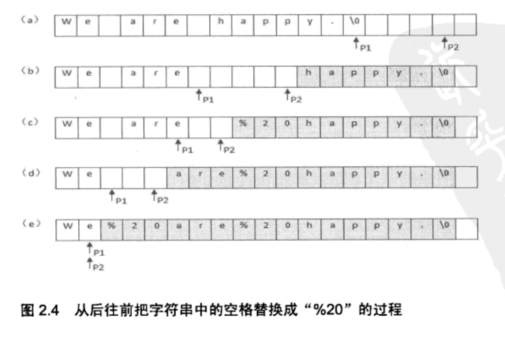

# 面试题5： 替换空格

请实现一个函数，把字符串中的每个空格替换成"%20"，例如，
输入"we are happy", 则输出"we%20are%20happy".


## 解法：优化的

先遍历一遍字符串，统计出字符串中空格的总数，然后就可以计算出替换
之后的字符串的总长度。每替换一个空格，长度增加2，因此替换以后字符串的长度
等于原来的长度加上2乘以空格数目。

我们以"we are happy"为例，这个字符串的长度是14，里面包含了两个空格
因此替换之后的字符串的长度是18.

从字符串的后面开始复制和替换。首先准备两个指针; p1和p2. p1指向原始字符串的末尾（图a），而p2指向替换之后的字符串的末尾。
接下来我们向前移动指针p1，逐个把它指向的字符串复制到p2指向的位置，直到碰到第一个空格为止。此时字符串如图(b)所示，灰色背景
的区域是进行了字符串复制的区域。碰到第一个空格之后，把p1向前移动1格，在p2之前插入字符串'%20', 由于'%20'的长度为3，同时
也要把p2向前移动3格，如图（c)

我们接着向前复制，直到碰到第二个空格，图（d），和上一次一样，我们再把p1向前移动1格，并把p2向前移动3格插入'%20', 
此时p1和p2指向同一位置，表明所有的空格都已经替换完毕。

所有的字符都只复制了一次，因此这个算法的时间效率是O(n)



## Code(rust)

```rust
// replace blank
fn replace_blank(mut par_str: String) -> String {
    if par_str.len() == 0 {
        return "".to_string();
    }

    // blank num
    let number_of_blank = par_str
        .chars()
        .filter(|&char| char == ' ')
        .count();

    let original_length = par_str.len();
    let new_length = original_length + number_of_blank * 2;

    // for append par_str num
    let number_blank = number_of_blank * 2;


    let mut index_of_original = original_length - 1;
    let mut index_of_new = new_length - 1;

    // change String to vec<char> for index
    let mut par_str: Vec<char> = par_str.chars().map(|val| val ).collect();

    // append blank to par_str
    let mut temp = vec![' ';number_blank];
    par_str.append(&mut temp);// append empty char

    while index_of_original < index_of_new {
        if par_str[index_of_original] == ' ' {
            par_str[index_of_new] = '0';
            index_of_new -= 1;
            par_str[index_of_new] = '2';
            index_of_new -= 1;
            par_str[index_of_new] = '%';
            index_of_new -= 1;
        } else {
            par_str[index_of_new] = par_str[index_of_original];
            index_of_new -= 1;
        }
        index_of_original -= 1;
    }

    let par_str = par_str.iter().map(|val| val).collect();
    par_str
}

#[test]
fn test_replace_blank() {
    let s = "we are happy".to_string();

    let ret = replace_blank(s);
    println!("********ret******** = {}", ret);
}
```

## Code(C)
## Code(Go)
## Code(Python3)
## Code(C++)
## Code(Java)
